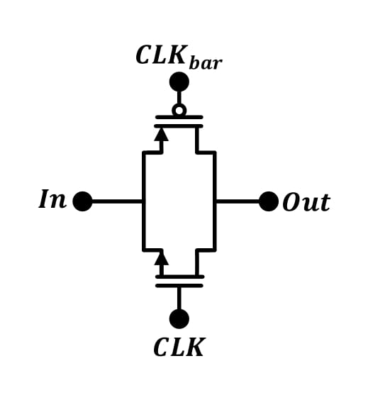

# Bluetooth PLL Design on Skywaters 130nm technology

 

*Warning*

   The current design is still under progress. This is an **experimental release**.
-  `In-Design`
-  `In-Layout`
-  `Finished`

----------------------
# Table of Contents

- [Introduction](#introduction)
- [System Model](#system-model)
- [Circuit Design](#circuit-design)
- [Circuit Simulation](#circuit-simulation)
- [Full Design](#full-design)
- [Circuit Layout](#circuit-layout)
- [Layout Simulation](#layout-simulation)
- [Tapeout using Caravel SoC](#tapeout-using-caravel-soc)

# Introduction

A fully integrated Sigma-Delta Fractional-N PLL for Wifi/Bluetooth applications is implemented using Open-Source PDKs by Google-Skywater 130nm. The entire design was built using Open-Source EDA tools such as Octave, python, xschem, ngspice and Klayout.

#  System Model

Fractional-N PLL architecture uses a Fractional Clock Divider with DSM block as the frequency divider in a PLL system. In order to make the frequency of the VCO output signal equivalent to the frequency of a PFD reference signal, the frequency divider divides the frequency by a fractional value using the delta sigma modulation technique.

**Advantages:**
* $𝑓_{𝑟𝑒𝑓}$ in range of tens $MHZ →Loop BW ≈𝑓𝑒𝑤\  𝑀𝐻𝑧$
* Average between $M$ and $M + 1$
* Channel spacing and $𝑓_{𝑟𝑒𝑓}$ “decoupled” high $𝑓_{𝑟𝑒𝑓}$ and a wide loop bandwidth to suppress the VCO phase noise
* Less “amplification” of the reference phase noise.\

**Disadvantages:**
* Spurs
     Solved by : Randomization for modulus control

## Protocols
Compatible with WIFI / Bluetooth wireless communication protocols\
$13$ WiFi channels  $2412→2472\ (5MHz Spacing)$\
$79$ Bluetooth channels $2402→2480\ (1MHz Spacing)$\
We need a resolution of 1 MHz, can’t be acquired by Integer N PLL since it needs $𝑓_{𝑟𝑒𝑓}\ 𝐶ℎ𝑎𝑛𝑛𝑒𝑙\ 𝑠𝑝𝑎𝑐𝑖𝑛𝑔$

Modern Fractional N PLL :\
Dual modulus prescaler control\
But how it works ? \
For prescaler divide by $N$ for __A(VCO)__ output pulses and $N+1$ for **B**
$$\frac{(𝐴+𝐵)}{[\frac{𝐴}{𝑁}+\frac{B}{[𝑁+1}]}$$

## Desmos Visualization of the channel specturm

* [Channel spectrum visual modeling](https://www.desmos.com/calculator/dbc4pmegdf)
* 

## System Design
### Crystal Oscillator
A Crystal Oscillator with 10MHz is used as a refrence input in our PLL design to cover the full range of Wifi/Bluetooth frequencies.
* $𝑓_{𝑟𝑒𝑓}=40 𝑀𝐻𝑧$ hard practical division ratio $75:25$
* $𝑓_{𝑟𝑒𝑓}=10 𝑀𝐻𝑧$ Easier practical division ratio $9:1$
* Phase noise $@\  1MHz$ offset	$<-140\  dBc/Hz$

#### Phase noise model

### PFD/CP

* $I𝐶𝑃=100𝜇𝐴$
* Compliance Range	$0.5V-1.5V$
* Phase noise $@\  1MHz$ offset	$<-223\  dBc/Hz$

#### Phase noise model

### Loop Filter

#### Phase noise model

### VCO

* Tuning range $[2.35G,2.55G]$.
* $𝐾𝑣𝑐𝑜\  ≈\  200MHz$
* Phase noise $@\  1MHz$ offset	$<-115\  dBc/Hz$

#### Phase noise model

Fractional N PLL with LC Osc (2.35GHz till 2.55GHz)\

### Divider 

Divider --> divide by $240.2 -248$ with step $0.1$ to get $1MHz$ resolution
For prescaler divide by $N$
	                                   

* $𝑓_{𝑅𝑒𝑓}=10\ 𝑀𝐻𝑧$
* Resoultion $1\ MHz$
* $DIV\  RATIO\  N=240-248$
* Step $0.1$
* Modulus control A B ratios	$𝐴=9\  ,\  𝐵=1$
$$\frac{(9+1)}{[\frac{9}{240}+\frac{1}{[240+1}]} \approx 240.09962 \approx 240.01$$ 

Phase Noise $@\  1\  MHz$ offset	$<-140$ dBc/Hz
#### Phase noise model

### Sigma Delta Modulator

* Need higher order sigma delta modulators for sharper noise shaping
* $3^{rd}$ Order sigma modulator

#### Phase noise model

## Total Phase Noise 

## System specifications 

| Spec | Value |
| --- | --- |
| `Center frequencies` | 2.402-2.480 GHz|
| `Phase noise @ 1MHz offset (From Standard)` |<-74 dBc/Hz |
| `Phase noise @ 2MHz offset (From Standard) ` |<-106 dBc/Hz|
| `Phase noise @ 3MHz offset (From Standard)` | <-116 dBc/Hz |
| `Synthesizer lock time (From Standard)  ` | (<68𝜇)|
| `Loop Bandwidth` | 150 KHz|
| `Phase margin ` | 55°|
| ` Expected Lock time   ` | 4/(𝐿𝑜𝑜𝑝 𝐵𝑊)≈26 𝜇𝑠|
| `Loop Filter Parameters` | Cz ≈268𝑝𝐹 ,Rz ≈12.5 𝐾Ohms , CP ≈29.5𝑝𝐹|

You can find the full specs for each block [here](pll/system/design_specs/Specs.md).

### System modeling is done using three differnt ways: 
  - [Verilog-A model](pll/system/verilog-A_model/README.md)
  - [Octave model](pll/system/octave_model/System_Modeling.md)
  - [python model](pll/system/python_model/README.md)

For PLL python modling, you could use google colab added [here](./pll/system/python_model/Jupyter_files/README.md) to have an interactive interface that you can use.

#  Circuit Design

During this stage, we designed the PLL using [xschem](https://github.com/StefanSchippers/xschem) tool. Each block is designed to achieve system design specifications. 

## Schematic 

###  Crystal Oscillator
----------------------
- Crystal Schematic

###  Band Gap Refrence (BGR) 
----------------------------------

* Proposed BGR circuit (Banba) :

* Core Circuit :

* OTA :

* Start-Up Circuit :

###  Phase/Frequency Detector (PFD) 
----------------------------------

## Introduction 

First simple PLL employs a phase detector PD which fundamentally measures the phase error only and fails to generate a meaningful dc value when the frequency difference between output and input is large. A wide acquisition range is needed so that a PLL that locks regardless of the initial value of the output frequency can be developed. The simple PLL can’t achieve this. And simple phase detector can be as simple as an (XOR) gate or an (XNOR) gate.

* simple phase detector 

A phase detector produces an output signal proportional to the phase difference of the signals applied to its inputs. But Normal phase detectors faced many problems. For example, the nominal lock point with an XOR phase detector is at the 90° static phase shift point and the phase detector range is only 𝜋 Also, if there is a frequency difference between the input reference and PLL feedback signals the phase detector can jump between regions of different gain which cause cycle slipping phenomenon as the PLL is no longer acting as a linear system and if the frequency difference is too large the PLL may not lock
 
* Phase frequency detector

For these problems of simple phase detector. Phase frequency detector is used to overcome these problems and have wide acquisition range. Phase frequency detector is a block that detects the phase and frequency differences between two signals which are reference signal and feedback signal from the divider in our case. Phase frequency detector has potential over normal phase detectors as it can detect both phase and frequency differences and herefor it allows wide locking range for the PLL

This PFD generates an Up and a Down signal that switches the current of the charge pump. The DFFs are triggered by the inputs to the PFD. Initially, both outputs are low. When one of the PFD inputs rises, the corresponding output becomes high. The state of the finite-state machine (FSM) moves from an initial state to an Up or Down state. The state is held until the second input goes high, which in turn resets the circuit and returns the FSM to the initial state and illustrates a common linear PFD architecture using resettable DFFs.

* PFD design issues

1. Dead zone

	Dead zone is defined as the maximum difference in phase between the two inputs that can’t be detecte by a PFD. When the phase difference is very narrow, this 		requires narrow pulses by the PFD, but due to the propagation delay of the internal devices these narrow pulses will not be generated. This can be avoided by 		some structures that remove the reset path, but these generated narrow pulses cannot activate the charge pump. So, the average output current will not 		follow the phase error and hence the transfer characteristics of the PFD and charge pump will exhibit a region of small or zero gain near the phase lock. 		Dead zone causes low loop gain and increases jitter and phase noise, so no dead zone is very important for better performance of the PLL. So, the     solution is to insert a delay in the reset path.

2. Skew between UP and DOWN signals and mismatch between their pulse widths

	These two arise from random propagation delay mismatches and can be minimized through the use of large transistors and layout symmetry. But these two effects 		negligibly affect the performance.

3.  Blind zone

	due to the delay of the reset path, the linear range is less than 4π, which results in an insensitivity to some transitions in the input signal. This is called 	the blind zone, at which the PFD generates wrong polarity pulses leading to wrong behavior in the loop which increases the acquisition time. This effect 	appears when phase difference is larger than 2π − ∆ where ∆ = 2π ∗ treset/Tref . So, to eliminate the blind zone we have to eliminate the reset path which is 		not a choice in our case as stated in the dead zone section.

* PFD Conv 

* PFD Implemented

* UP flip-flop 

* DOWN flip-flop

* NOR-Gate

### Charge Pump (CP)
--------------------

* Charge Pump block diagram

* Charge pump circuit 

* OTA

###  Loop Filter
---------------
* Third order loop filter 

###  Voltage Controlled Oscillator 
---------------------------------
* LC VCO

###  Fractional Divider
----------------------
#### Full Divider design

#### Divider Cell 

#### D-Flipflop design

#### Transmission gate (TG) design

#### NAND gate design

#### Inverter design

#### AND gate design

### Delta Sigma Modulator
-------------------------

• The implemented Sigma-Delta Modulator is a MASH (Multi Stage Noise Shaping) architecture of 3rd order.

• The implemented Sigma-Delta Modulator has the following inputs and outputs:

    - Inputs:   → Input channel bits (7 bits): Used to select a certain channel.
                → Clock (1 bit): Used for the registers in the design.
                → Reset (1 bit): Used to reset the registers in the design.
    -----------------------------------------------------------------------------
    - Output:   → Output passed to the divider (5 bits).

• The internal structure of the DSM is as follows:
    - DSM Core: Where the main function of the DSM is occurred and the random sequence with a functional average is generated.
    - Control Unit: Responsible for mapping the input number of channel to the required input for the DSM to generate the required fraction, also it gets the integer part       of this input channel and adds it to the fraction part to construct the required fractional division. For example if the input channel requires us to divide by 243.7,       then the control unit will give the DSM core the input which gives an average output of 0.7 and also this control unit will output a constant value of 13 which if           passed to the divider will divide by a division ratio of 243 and then these 2 values the 2nd output of the control unit and the output of the DSM core will be added and     then passed to the divider as an input to get the desired 243.7 division ratio
    

_____
  
#### Digital Implementation of the DSM Core

• The typical implementation of a MASH architecture is composed of a number of accumulators, adders, and regiesters arranged as illustrated:

____
  

##### DSM Core Blocks
The designed Delta-Sgima Modulator (DSM) is implemented using Verilog HDL and is composed into 3 modules as follows:
###### 1. Accumulator
• The accumulator in this design has 3 inputs (In_Data, CLK, Reset) and 2 outputs (Out_Data, Cout) as shown:

• The size of the accumulators is of 24 bits to increase the resolution to obtain a precise fraction.

###### 2. Special Adder
• This adder adds 2 numbers then subtracts a third number from them, it has 3 inputs and 1 output:

# Circuit Simulation

### Crystal Oscillator
----------------------

### Phase/Frequency Detector (PFD) 
----------------------------------

### Charge Pump (CP)
--------------------

### Loop Filter (LPF)
---------------------

### Voltage Controlled Oscillator (VCO)
---------------------------------------

### Fractional Divider
----------------------

### Delta Sigma Modulator
-------------------------

# Full Design

# Circuit Layout

# Layout Simulation

# Tapeout using Caravel SoC

Refer to [README](docs/source/index.rst) for this sample project documentation. 
