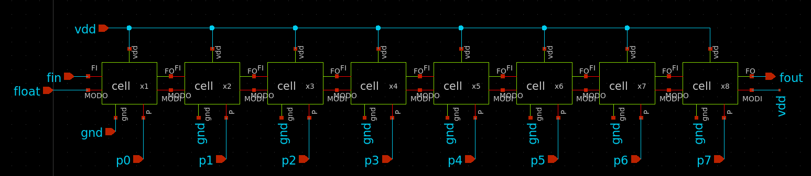

# Wifi/Bluetooth PLL Design on Skywaters 130nm technology

 

*Warning*

   The current design still under progress. This is an **experimental release**.

----------------------
# Table of Contents

- [Introduction](#introduction)
- [System Model](#system-model)
- [Circuit Design](#circuit-design)
- [Circuit Simulation](#circuit-simulation)
- [Full Design](#full-design)
- [Circuit Layout](#circuit-layout)
- [Layout Simulation](#layout-simulation)
- [Tapeout using Caravel SoC](#tapeout-using-caravel-soc)

# Introduction

A fully integrated Sigma-Delta Fractional-N PLL for Wifi/Bluetooth applications is implemented using Open-Source PDKs by Google-Skywater 130nm. The entire design was built using Open-Source EDA tools such as Octave, python, xschem, ngspice and Klayout.

# System Model

The Sigma-Delta Fractional-N PLL architecture uses a Fractional Clock Divider with DSM block as the frequency divider in a PLL system. In order to make the frequency of the VCO output signal equivalent to the frequency of a PFD reference signal, the frequency divider divides the frequency by a fractional value using the delta sigma modulation technique. 

A Crystal Oscillator with 10MHz is used as a refrence input in our PLL design to cover the full range of Wifi/Bluetooth frequencies. For more details, you could check this [README](pll/system/design_specs/README.md) file

## System specifications 

| Spec | Value |
| --- | --- |
| `Center frequencies` | 2.402-2.480 GHz|
| `Phase noise @ 1MHz offset (From Standard)` |<-74 dBc/Hz |
| `Phase noise @ 2MHz offset (From Standard) ` |<-106 dBc/Hz|
| `Phase noise @ 3MHz offset (From Standard)` | <-116 dBc/Hz |
| `Synthesizer lock time (From Standard)  ` | (<68𝜇)|
| `Loop Bandwidth` | 150 KHz|
| `Phase margin ` | 55°|
| ` Expected Lock time   ` | 4/(𝐿𝑜𝑜𝑝 𝐵𝑊)≈26 𝜇𝑠|
| `Loop Filter Parameters` | Cz ≈268𝑝𝐹 ,Rz ≈12.5 𝐾Ohms , CP ≈29.5𝑝𝐹|

You can find the full specs for each block [here](pll/system/design_specs/Specs.md).

### System modeling is done using three differnt ways: 
  - [Verilog-A model](pll/system/verilog-A_model/README.md)
  - [Octave model](pll/system/octave_model/System_Modeling.md)
  - [python model](pll/system/python_model/README.md)

# Circuit Design

During this stage, we designed the PLL using [xschem](https://github.com/StefanSchippers/xschem) tool. Each block is designed to achieve system design specifications. 

## Schematic 

### Crystal Oscillator
----------------------

### Phase/Frequency Detector (PFD) 
----------------------------------

### Charge Pump (CP)
--------------------

### Loop Filter
---------------

### Voltage Controlled Oscillator 
---------------------------------

### Fractional Divider
----------------------
#### Full Divider design

#### Divider Cell 

#### D-Flipflop design

#### Transmission gate (TG) design

#### AND gate design

#### NAND gate design

#### Inverter design

### Delta Sigma Modulator
-------------------------

# Circuit Simulation

### Crystal Oscillator
----------------------

### Phase/Frequency Detector (PFD) 
----------------------------------

### Charge Pump (CP)
--------------------

### Loop Filter (LPF)
---------------------

### Voltage Controlled Oscillator (VCO)
---------------------------------------

### Fractional Divider
----------------------

### Delta Sigma Modulator
-------------------------

# Full Design

# Circuit Layout

# Layout Simulation

# Tapeout using Caravel SoC

Refer to [README](docs/source/index.rst) for this sample project documentation. 
