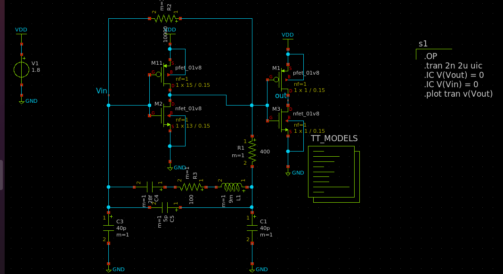
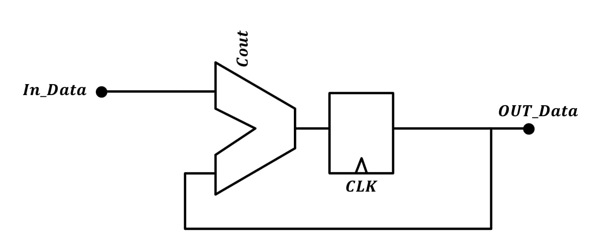

# Bluetooth PLL Design on Skywaters 130nm technology

 

*Warning*

   The current design is still under progress. This is an **experimental release**.
-  `In-Design`
-  `In-Layout`
-  `Finished`

----------------------
# Table of Contents

- [Introduction](#introduction)
- [System Model](#system-model)
- [Circuit Design](#circuit-design)
- [Circuit Simulation](#circuit-simulation)
- [Full Design](#full-design)
- [Circuit Layout](#circuit-layout)
- [Layout Simulation](#layout-simulation)
- [Tapeout using Caravel SoC](#tapeout-using-caravel-soc)

# Introduction

A fully integrated Sigma-Delta Fractional-N PLL for Wifi/Bluetooth applications is implemented using Open-Source PDKs by Google-Skywater 130nm. The entire design was built using Open-Source EDA tools such as Octave, python, xschem, ngspice and Klayout.

#  System Model

Fractional-N PLL architecture uses a Fractional Clock Divider with DSM block as the frequency divider in a PLL system. In order to make the frequency of the VCO output signal equivalent to the frequency of a PFD reference signal, the frequency divider divides the frequency by a fractional value using the delta sigma modulation technique.

**Advantages:**
* $𝑓_{𝑟𝑒𝑓}$ in range of tens $MHZ →Loop BW ≈𝑓𝑒𝑤\  𝑀𝐻𝑧$
* Average between $M$ and $M + 1$
* Channel spacing and $𝑓_{𝑟𝑒𝑓}$ “decoupled” high $𝑓_{𝑟𝑒𝑓}$ and a wide loop bandwidth to suppress the VCO phase noise
* Less “amplification” of the reference phase noise.\

**Disadvantages:**
* Spurs
     Solved by : Randomization for modulus control

## Protocols
Compatible with WIFI / Bluetooth wireless communication protocols\
$13$ WiFi channels  $2412→2472\ (5MHz Spacing)$\
$79$ Bluetooth channels $2402→2480\ (1MHz Spacing)$\
We need a resolution of 1 MHz, can’t be acquired by Integer N PLL since it needs $𝑓_{𝑟𝑒𝑓}\ 𝐶ℎ𝑎𝑛𝑛𝑒𝑙\ 𝑠𝑝𝑎𝑐𝑖𝑛𝑔$

Modern Fractional N PLL :\
Dual modulus prescaler control\
But how it works ? \
For prescaler divide by $N$ for __A(VCO)__ output pulses and $N+1$ for **B**
$$\frac{(𝐴+𝐵)}{[\frac{𝐴}{𝑁}+\frac{B}{[𝑁+1}]}$$

## Desmos Visualization of the channel specturm

* [Channel spectrum visual modeling](https://www.desmos.com/calculator/dbc4pmegdf)
* 

## System Design
### Crystal Oscillator
A Crystal Oscillator with 10MHz is used as a refrence input in our PLL design to cover the full range of Wifi/Bluetooth frequencies.
* $𝑓_{𝑟𝑒𝑓}=40 𝑀𝐻𝑧$ hard practical division ratio $75:25$
* $𝑓_{𝑟𝑒𝑓}=10 𝑀𝐻𝑧$ Easier practical division ratio $9:1$
* Phase noise $@\  1MHz$ offset	$<-140\  dBc/Hz$

#### Phase noise model

### PFD/CP

* $I𝐶𝑃=100𝜇𝐴$
* Compliance Range	$0.5V-1.5V$
* Phase noise $@\  1MHz$ offset	$<-223\  dBc/Hz$

#### Phase noise model

### Loop Filter

#### Phase noise model

### VCO

* Tuning range $[2.35G,2.55G]$.
* $𝐾𝑣𝑐𝑜\  ≈\  200MHz$
* Phase noise $@\  1MHz$ offset	$<-115\  dBc/Hz$

#### Phase noise model

Fractional N PLL with LC Osc (2.35GHz till 2.55GHz)\

### Divider 

Divider --> divide by $240.2 -248$ with step $0.1$ to get $1MHz$ resolution
For prescaler divide by $N$
	                                   

* $𝑓_{𝑅𝑒𝑓}=10\ 𝑀𝐻𝑧$
* Resoultion $1\ MHz$
* $DIV\  RATIO\  N=240-248$
* Step $0.1$
* Modulus control A B ratios	$𝐴=9\  ,\  𝐵=1$
$$\frac{(9+1)}{[\frac{9}{240}+\frac{1}{[240+1}]} \approx 240.09962 \approx 240.01$$ 

Phase Noise $@\  1\  MHz$ offset	$<-140$ dBc/Hz
#### Phase noise model

### Sigma Delta Modulator

* Need higher order sigma delta modulators for sharper noise shaping
* $3^{rd}$ Order sigma modulator

#### Phase noise model

## Total Phase Noise 

## System specifications 

| Spec | Value |
| --- | --- |
| `Center frequencies` | 2.402-2.480 GHz|
| `Phase noise @ 1MHz offset (From Standard)` |<-74 dBc/Hz |
| `Phase noise @ 2MHz offset (From Standard) ` |<-106 dBc/Hz|
| `Phase noise @ 3MHz offset (From Standard)` | <-116 dBc/Hz |
| `Synthesizer lock time (From Standard)  ` | (<68𝜇)|
| `Loop Bandwidth` | 150 KHz|
| `Phase margin ` | 55°|
| ` Expected Lock time   ` | 4/(𝐿𝑜𝑜𝑝 𝐵𝑊)≈26 𝜇𝑠|
| `Loop Filter Parameters` | Cz ≈268𝑝𝐹 ,Rz ≈12.5 𝐾Ohms , CP ≈29.5𝑝𝐹|

You can find the full specs for each block [here](pll/system/design_specs/Specs.md).

### System modeling is done using three differnt ways: 
  - [Verilog-A model](pll/system/verilog-A_model/README.md)
  - [Octave model](pll/system/octave_model/System_Modeling.md)
  - [python model](pll/system/python_model/README.md)

For PLL python modling, you could use google colab added [here](./pll/system/python_model/Jupyter_files/README.md) to have an interactive interface that you can use.

#  Circuit Design

During this stage, we designed the PLL using [xschem](https://github.com/StefanSchippers/xschem) tool. Each block is designed to achieve system design specifications. 

## Schematic 

###  Crystal Oscillator
----------------------
- Crystal Schematic

###  Band Gap Refrence (BGR) 
----------------------------------

* Proposed BGR circuit (Banba) :

* Core Circuit :

* OTA :

* Start-Up Circuit :

###  Phase/Frequency Detector (PFD) 
----------------------------------

* PFD Conv 

* PFD Implemented

* UP flip-flop 

* DOWN flip-flop

* NOR-Gate

### Charge Pump (CP)
--------------------

## Introduction 

type-I loop suffers from the trade-offs between the static phase error, loop bandwidth and stability. So, to solve this issue the charge pump is introduced. A charge pump is the first analog component of a PLL that will be considered. It is located between the PFD and the Loop Filter and responsible for placing charge into or taking charge out of the loop filter based on the output of the PFD, as it converts the up and down pulses into current pulses and these current pulses change voltage drop on the loop filter impedance which is the VCO control voltage. Charge pump must be very carefully designed to minimize reference feedthrough or phase noise since the noise generated by it affects the VCO noise.

## CP operation 
 When the rising edge of the reference input REF leads that of the VCO feedback input FB, the PFD output UP is high and the CP delivers charges to the capacitors in the loop filter. Thus, the loop filter output voltage increases and so does the VCO output frequency. Therefore, the CP together with the PFD transfer phase difference into current.A good charge pump should feature equal charge and discharge currents, minimum switching errors such as charge injection, charge sharing, and clock feedthrough, and minimum output current mismatches. It utilizes a mismatch-cancellation circuit to reduce current mismatch. On the other hand, the mismatch-cancellation circuit senses any mismatch between charging and discharging current. Then according to this mismatch, the biasing of Idn is automatically adjusted so that discharging current Idn follows any change in the charging current Iup. At steady state, there is a very low mismatch between the charging and discharging currents.

## CP design issues 
1. Current Mismatch
Current mismatch means that the up and down currents are not equal. Since the switches are basically PMOS transistor for the up switch and NMOS transistor for the down switch, there is a variation between up and down currents due to the different mobility of the P and the N Moses. This phenomenon leads to different Vcontrol for the same value of “up” and “dn”. So, if the current values Iup and Idn are not exactly same, or there is some delay between the controlled signals UP and DN, then there will be a natural phase error between reference frequency and output frequency of the VCO even if the PLL is in locked state.

To reduce current mismatch in the Charge pump there are several approaches that can be made. The output resistance of the charge pump can be increased by either using a cascode or a gain – boosting topology
2.  UP and DOWN skew
The arriving of UP and DOWN pulses should be guaranteed in order to open and close UP and DOWN currents simultaneously, if there is a skew between them his leads to ripples in Vctrl. But this problem is alleviated using the timing circuit as will be discussed. To solve this problem, we should normalize the delay of the up and down signals until they reach the charge pump so we can add a delay element to the down signal path such that it takes the same time to reach the NMOS switch.
3.  Voltage Compliance and Channel-Length Modulation.
The major challenge in the design of the charge pump is the channel length modulation. The VCO is controlled by the voltage generated by the charge pump and the loop filter. In order to have a wide tuning range for the VCO the voltage compliance of the charge pump should be maximized. But this gives rise to the problem of channel length modulation in the current sources. When the output voltage of the CP is high, Vds of the UP current source is low and Vds of the DOWN current source is high. Due to channel-length modulation, this makes the UP current smaller than the down current. And vice versa when the output voltage is low. This increases the current mismatch between the two currents.
* CP with unity gain buffer

We settled on the modified current steering charge pump with unity gain active amplifier because it’s very fast over the conventional single ended charge pump. We used a wide swing cascodes for up and down currents to minimize current mismatch and current variation with the control voltage. This unity gain amplifier buffers the voltage at the output node forcing the drain voltage of the current sources IDN and IUP to be the same when M1 and M2 are on or when they are off. This reduces the charge sharing effect, when the switch is turned on. This architecture ensures fast transient response through current steering, reduces the effect of any parasitic capacitance, at the expense of extra current.

* Charge Pump block diagram

* Charge pump circuit 

* OTA

## simulation results

* Dn signal =VDD up signal =0

* DN=0 , UP=VDD

* DN=VDD , UP=VDD

## simulation Results across corners 
	
	1.  0.9VDD:VDD:1.1VDD (supply variations across corners)
	2. -40:27:125  (temparture variations across corners) 
	3. ss,ff,sf,fs,tt (process variations across corners)
	
*  Dn signal =VDD up signal =0

* DN=0 , UP=VDD across corners

* DN=VDD , UP=VDD

* Current variations less than +5% or -5% across corners. 

###  Loop Filter
---------------
* Third order loop filter 

###  Voltage Controlled Oscillator 
---------------------------------
* LC VCO

###  Fractional Divider
----------------------
#### Full Divider design

#### Divider Cell 

#### D-Flipflop design

#### Transmission gate (TG) design

#### NAND gate design

#### Inverter design

#### AND gate design

### Delta Sigma Modulator
-------------------------

• The implemented Sigma-Delta Modulator is a MASH (Multi Stage Noise Shaping) architecture of 3rd order.

• The implemented Sigma-Delta Modulator has the following inputs and outputs:

    - Inputs:   → Input channel bits (7 bits): Used to select a certain channel.
                → Clock (1 bit): Used for the registers in the design.
                → Reset (1 bit): Used to reset the registers in the design.
    -----------------------------------------------------------------------------
    - Output:   → Output passed to the divider (5 bits).

• The internal structure of the DSM is as follows:
    - DSM Core: Where the main function of the DSM is occurred and the random sequence with a functional average is generated.
    - Control Unit: Responsible for mapping the input number of channel to the required input for the DSM to generate the required fraction, also it gets the integer part       of this input channel and adds it to the fraction part to construct the required fractional division. For example if the input channel requires us to divide by 243.7,       then the control unit will give the DSM core the input which gives an average output of 0.7 and also this control unit will output a constant value of 13 which if           passed to the divider will divide by a division ratio of 243 and then these 2 values the 2nd output of the control unit and the output of the DSM core will be added and     then passed to the divider as an input to get the desired 243.7 division ratio
    

_____
  
#### Digital Implementation of the DSM Core

• The typical implementation of a MASH architecture is composed of a number of accumulators, adders, and regiesters arranged as illustrated:

____
  

##### DSM Core Blocks
The designed Delta-Sgima Modulator (DSM) is implemented using Verilog HDL and is composed into 3 modules as follows:
###### 1. Accumulator
• The accumulator in this design has 3 inputs (In_Data, CLK, Reset) and 2 outputs (Out_Data, Cout) as shown:

• The size of the accumulators is of 24 bits to increase the resolution to obtain a precise fraction.

###### 2. Special Adder
• This adder adds 2 numbers then subtracts a third number from them, it has 3 inputs and 1 output:

# Circuit Simulation

### Crystal Oscillator
----------------------

### Phase/Frequency Detector (PFD) 
----------------------------------

### Charge Pump (CP)
--------------------

### Loop Filter (LPF)
---------------------

### Voltage Controlled Oscillator (VCO)
---------------------------------------

### Fractional Divider
----------------------

### Delta Sigma Modulator
-------------------------

# Full Design

# Circuit Layout

# Layout Simulation

# Tapeout using Caravel SoC

Refer to [README](docs/source/index.rst) for this sample project documentation. 
