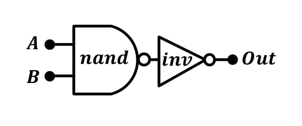
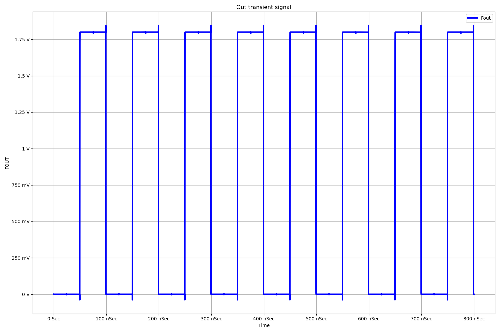

# Bluetooth PLL Design on Skywaters 130nm technology

 

*Warning*

   The current design is still under progress. This is an **experimental release**.
-  `In-Design`
-  `In-Layout`
-  `Finished`

----------------------
# Table of Contents

- [Introduction](#introduction)
- [System Model](#system-model)
- [Circuit Design](#circuit-design)
- [Circuit Simulation](#circuit-simulation)
- [Full Design](#full-design)
- [Circuit Layout](#circuit-layout)
- [Layout Simulation](#layout-simulation)
- [Tapeout using Caravel SoC](#tapeout-using-caravel-soc)

# Introduction

A fully integrated Sigma-Delta Fractional-N PLL for Wifi/Bluetooth applications is implemented using Open-Source PDKs by Google-Skywater 130nm. The entire design was built using Open-Source EDA tools such as Octave, python, xschem, ngspice and Klayout.

#  System Model

Fractional-N PLL architecture uses a Fractional Clock Divider with DSM block as the frequency divider in a PLL system. In order to make the frequency of the VCO output signal equivalent to the frequency of a PFD reference signal, the frequency divider divides the frequency by a fractional value using the delta sigma modulation technique.

**Advantages:**
* $𝑓_{𝑟𝑒𝑓}$ in range of tens $MHZ →Loop BW ≈𝑓𝑒𝑤\  𝑀𝐻𝑧$
* Average between $M$ and $M + 1$
* Channel spacing and $𝑓_{𝑟𝑒𝑓}$ “decoupled” high $𝑓_{𝑟𝑒𝑓}$ and a wide loop bandwidth to suppress the VCO phase noise
* Less “amplification” of the reference phase noise.\

**Disadvantages:**
* Spurs
     Solved by : Randomization for modulus control

## Protocols
Compatible with WIFI / Bluetooth wireless communication protocols\
$13$ WiFi channels  $2412→2472\ (5MHz Spacing)$\
$79$ Bluetooth channels $2402→2480\ (1MHz Spacing)$\
We need a resolution of 1 MHz, can’t be acquired by Integer N PLL since it needs $𝑓_{𝑟𝑒𝑓}\ 𝐶ℎ𝑎𝑛𝑛𝑒𝑙\ 𝑠𝑝𝑎𝑐𝑖𝑛𝑔$

Modern Fractional N PLL :\
Dual modulus prescaler control\
But how it works ? \
For prescaler divide by $N$ for __A(VCO)__ output pulses and $N+1$ for **B**
$$\frac{(𝐴+𝐵)}{[\frac{𝐴}{𝑁}+\frac{B}{[𝑁+1}]}$$

## Desmos Visualization of the channel specturm

* [Channel spectrum visual modeling](https://www.desmos.com/calculator/dbc4pmegdf)
* 

## System Design
### Crystal Oscillator
A Crystal Oscillator with 10MHz is used as a refrence input in our PLL design to cover the full range of Wifi/Bluetooth frequencies.
* $𝑓_{𝑟𝑒𝑓}=40 𝑀𝐻𝑧$ hard practical division ratio $75:25$
* $𝑓_{𝑟𝑒𝑓}=10 𝑀𝐻𝑧$ Easier practical division ratio $9:1$
* Phase noise $@\  1MHz$ offset	$<-140\  dBc/Hz$

#### Phase noise model

### PFD/CP

* $I𝐶𝑃=100𝜇𝐴$
* Compliance Range	$0.5V-1.5V$
* Phase noise $@\  1MHz$ offset	$<-223\  dBc/Hz$

#### Phase noise model

### Loop Filter

#### Phase noise model

### VCO

* Tuning range $[2.35G,2.55G]$.
* $𝐾𝑣𝑐𝑜\  ≈\  200MHz$
* Phase noise $@\  1MHz$ offset	$<-115\  dBc/Hz$

#### Phase noise model

Fractional N PLL with LC Osc (2.35GHz till 2.55GHz)\

### Divider 

Divider --> divide by $240.2 -248$ with step $0.1$ to get $1MHz$ resolution
For prescaler divide by $N$
	                                   

* $𝑓_{𝑅𝑒𝑓}=10\ 𝑀𝐻𝑧$
* Resoultion $1\ MHz$
* $DIV\  RATIO\  N=240-248$
* Step $0.1$
* Modulus control A B ratios	$𝐴=9\  ,\  𝐵=1$
$$\frac{(9+1)}{[\frac{9}{240}+\frac{1}{[240+1}]} \approx 240.09962 \approx 240.01$$ 

Phase Noise $@\  1\  MHz$ offset	$<-140$ dBc/Hz
#### Phase noise model

### Sigma Delta Modulator

* Need higher order sigma delta modulators for sharper noise shaping
* $3^{rd}$ Order sigma modulator

#### Phase noise model

## Total Phase Noise 

## System specifications 

| Spec | Value |
| --- | --- |
| `Center frequencies` | 2.402-2.480 GHz|
| `Phase noise @ 1MHz offset (From Standard)` |<-74 dBc/Hz |
| `Phase noise @ 2MHz offset (From Standard) ` |<-106 dBc/Hz|
| `Phase noise @ 3MHz offset (From Standard)` | <-116 dBc/Hz |
| `Synthesizer lock time (From Standard)  ` | (<68𝜇)|
| `Loop Bandwidth` | 150 KHz|
| `Phase margin ` | 55°|
| ` Expected Lock time   ` | 4/(𝐿𝑜𝑜𝑝 𝐵𝑊)≈26 𝜇𝑠|
| `Loop Filter Parameters` | Cz ≈268𝑝𝐹 ,Rz ≈12.5 𝐾Ohms , CP ≈29.5𝑝𝐹|

You can find the full specs for each block [here](pll/system/design_specs/Specs.md).

### System modeling is done using three differnt ways: 
  - [Verilog-A model](pll/system/verilog-A_model/README.md)
  - [Octave model](pll/system/octave_model/System_Modeling.md)
  - [python model](pll/system/python_model/README.md)

For PLL python modling, you could use google colab added [here](./pll/system/python_model/Jupyter_files/README.md) to have an interactive interface that you can use.

#  Circuit Design

During this stage, we designed the PLL using [xschem](https://github.com/StefanSchippers/xschem) tool. Each block is designed to achieve system design specifications. 

## Schematic 

###  Crystal Oscillator
----------------------
- Crystal Schematic

###  Band Gap Refrence (BGR) 
----------------------------------

* Proposed BGR circuit (Banba) :

* Core Circuit :

* OTA :

* Start-Up Circuit :

###  Phase/Frequency Detector (PFD) 
----------------------------------
## Introduction 

First simple PLL employs a phase detector PD which fundamentally measures the phase error only and fails to generate a meaningful dc value when the frequency difference between output and input is large. A wide acquisition range is needed so that a PLL that locks regardless of the initial value of the output frequency can be developed. The simple PLL can’t achieve this. And simple phase detector can be as simple as an (XOR) gate or an (XNOR) gate.

* simple phase detector 

A phase detector produces an output signal proportional to the phase difference of the signals applied to its inputs. But Normal phase detectors faced many problems. For example, the nominal lock point with an XOR phase detector is at the 90° static phase shift point and the phase detector range is only 𝜋 Also, if there is a frequency difference between the input reference and PLL feedback signals the phase detector can jump between regions of different gain which cause cycle slipping phenomenon as the PLL is no longer acting as a linear system and if the frequency difference is too large the PLL may not lock
 
* Phase frequency detector

For these problems of simple phase detector. Phase frequency detector is used to overcome these problems and have wide acquisition range. Phase frequency detector is a block that detects the phase and frequency differences between two signals which are reference signal and feedback signal from the divider in our case. Phase frequency detector has potential over normal phase detectors as it can detect both phase and frequency differences and herefor it allows wide locking range for the PLL

This PFD generates an Up and a Down signal that switches the current of the charge pump. The DFFs are triggered by the inputs to the PFD. Initially, both outputs are low. When one of the PFD inputs rises, the corresponding output becomes high. The state of the finite-state machine (FSM) moves from an initial state to an Up or Down state. The state is held until the second input goes high, which in turn resets the circuit and returns the FSM to the initial state and illustrates a common linear PFD architecture using resettable DFFs.

* PFD design issues

1. Dead zone

	Dead zone is defined as the maximum difference in phase between the two inputs that can’t be detecte by a PFD. When the phase difference is very narrow, this 		requires narrow pulses by the PFD, but due to the propagation delay of the internal devices these narrow pulses will not be generated. This can be avoided by 		some structures that remove the reset path, but these generated narrow pulses cannot activate the charge pump. So, the average output current will not 		follow the phase error and hence the transfer characteristics of the PFD and charge pump will exhibit a region of small or zero gain near the phase lock. 		Dead zone causes low loop gain and increases jitter and phase noise, so no dead zone is very important for better performance of the PLL. So, the     solution is to insert a delay in the reset path.

2. Skew between UP and DOWN signals and mismatch between their pulse widths

	These two arise from random propagation delay mismatches and can be minimized through the use of large transistors and layout symmetry. But these two effects 		negligibly affect the performance.

3.  Blind zone

	due to the delay of the reset path, the linear range is less than 4π, which results in an insensitivity to some transitions in the input signal. This is called 	the blind zone, at which the PFD generates wrong polarity pulses leading to wrong behavior in the loop which increases the acquisition time. This effect 	appears when phase difference is larger than 2π − ∆ where ∆ = 2π ∗ treset/Tref . So, to eliminate the blind zone we have to eliminate the reset path which is 		not a choice in our case as stated in the dead zone section.

* PFD operation 

* the signal passes less gate for a high speed; on the other hand, the NOR gate can provide some delay to reduce the dead-zone. The operations of this PFD are very simple: when the input signal (REF) and the reset signal (RESET) are both low, node A is charged up to VDD though MP1 and MP2. At the rising edge of the signal, node B is connected to ground though MN2 and MN3, yielding the output signal (UP) to be HIGH due to the inversion. Then after that, node B is not affected by the input signal since charges at node A turn off MP3 and prevent node B from pulled up. Therefore, the output is always high after the rising edge of the input signal. When RESET is applied, node A is discharged to ground through MN1 and node B is pulled up though MP3, causing output UP signal to reset. The RESET signal is asserted when the second DFF input signal (FB) experiences a rising edge. When the PFD collects two rising edges the REF and FB, the NOR gate will assert the RESET signal and reset the output signals. The PFD is a 4-state PFD Since it has a state when the outputs are both high. The width of the reset pulse is determined by the delay in the NOR gate. The effect of this delay on the maximum operating frequency is discussed in the following subsection. In the design, the NOR gate has a delay of 150 ps.

* Conventional PFD

* PFD Implemented

* UP flip-flop 

* DOWN flip-flop

* NOR-Gate

## Simulation Results
* REF lags from FB  by 1ns 

*  Another case when delay between Ref and Fb equals 0 (locking case)

* When  fB lags from REF  by 95ns

* When  fB lags by 50ps (small phase error)

* Reason for dead zone

the small phase error cannot be detected properly explains the reason for dead-zone: if the phase difference is small, the output pulses may not be able to activate the CP completely, yielding a zero PD gain and loop gain, and the loop is basically open and the PLL noise is the same as a free running VCO noise. Delay can be added at the reset path to avoid this issue.

## simulation Results across corrners:
	1.  0.9VDD:VDD:1.1VDD (supply variations across corners)
	2. -40:27:125  (temparture variations across corners) 
	3. ss,ff,sf,fs,tt (process variations across corners)
	4. Ref_delay and FB_delay different cases {10n,0},{0,10n},{1n,1.1n}
	  

* Fb lags from Ref across corners

* REF lags from FB across corners

* When phase error is very small to  ensure that pulse width is sufficient for  Cp switching.  

### Charge Pump (CP)
--------------------

## Introduction 

type-I loop suffers from the trade-offs between the static phase error, loop bandwidth and stability. So, to solve this issue the charge pump is introduced. A charge pump is the first analog component of a PLL that will be considered. It is located between the PFD and the Loop Filter and responsible for placing charge into or taking charge out of the loop filter based on the output of the PFD, as it converts the up and down pulses into current pulses and these current pulses change voltage drop on the loop filter impedance which is the VCO control voltage. Charge pump must be very carefully designed to minimize reference feedthrough or phase noise since the noise generated by it affects the VCO noise.

## CP operation 
 When the rising edge of the reference input REF leads that of the VCO feedback input FB, the PFD output UP is high and the CP delivers charges to the capacitors in the loop filter. Thus, the loop filter output voltage increases and so does the VCO output frequency. Therefore, the CP together with the PFD transfer phase difference into current.A good charge pump should feature equal charge and discharge currents, minimum switching errors such as charge injection, charge sharing, and clock feedthrough, and minimum output current mismatches. It utilizes a mismatch-cancellation circuit to reduce current mismatch. On the other hand, the mismatch-cancellation circuit senses any mismatch between charging and discharging current. Then according to this mismatch, the biasing of Idn is automatically adjusted so that discharging current Idn follows any change in the charging current Iup. At steady state, there is a very low mismatch between the charging and discharging currents.

## CP design issues 
1. Current Mismatch
Current mismatch means that the up and down currents are not equal. Since the switches are basically PMOS transistor for the up switch and NMOS transistor for the down switch, there is a variation between up and down currents due to the different mobility of the P and the N Moses. This phenomenon leads to different Vcontrol for the same value of “up” and “dn”. So, if the current values Iup and Idn are not exactly same, or there is some delay between the controlled signals UP and DN, then there will be a natural phase error between reference frequency and output frequency of the VCO even if the PLL is in locked state.

To reduce current mismatch in the Charge pump there are several approaches that can be made. The output resistance of the charge pump can be increased by either using a cascode or a gain – boosting topology
2.  UP and DOWN skew
The arriving of UP and DOWN pulses should be guaranteed in order to open and close UP and DOWN currents simultaneously, if there is a skew between them his leads to ripples in Vctrl. But this problem is alleviated using the timing circuit as will be discussed. To solve this problem, we should normalize the delay of the up and down signals until they reach the charge pump so we can add a delay element to the down signal path such that it takes the same time to reach the NMOS switch.
3.  Voltage Compliance and Channel-Length Modulation.
The major challenge in the design of the charge pump is the channel length modulation. The VCO is controlled by the voltage generated by the charge pump and the loop filter. In order to have a wide tuning range for the VCO the voltage compliance of the charge pump should be maximized. But this gives rise to the problem of channel length modulation in the current sources. When the output voltage of the CP is high, Vds of the UP current source is low and Vds of the DOWN current source is high. Due to channel-length modulation, this makes the UP current smaller than the down current. And vice versa when the output voltage is low. This increases the current mismatch between the two currents.
* CP with unity gain buffer

We settled on the modified current steering charge pump with unity gain active amplifier because it’s very fast over the conventional single ended charge pump. We used a wide swing cascodes for up and down currents to minimize current mismatch and current variation with the control voltage. This unity gain amplifier buffers the voltage at the output node forcing the drain voltage of the current sources IDN and IUP to be the same when M1 and M2 are on or when they are off. This reduces the charge sharing effect, when the switch is turned on. This architecture ensures fast transient response through current steering, reduces the effect of any parasitic capacitance, at the expense of extra current.

* Charge Pump block diagram

* Charge pump circuit 

* OTA

## simulation results

* Dn signal =VDD up signal =0

* DN=0 , UP=VDD

* DN=VDD , UP=VDD

## simulation Results across corners 
	
	1.  0.9VDD:VDD:1.1VDD (supply variations across corners)
	2. -40:27:125  (temparture variations across corners) 
	3. ss,ff,sf,fs,tt (process variations across corners)
	
*  Dn signal =VDD up signal =0

* DN=0 , UP=VDD across corners

* DN=VDD , UP=VDD

* Current variations less than +5% or -5% across corners. 

###  Voltage Controlled Oscillator 
---------------------------------
* LC VCO

###  Fractional Divider
----------------------

#### Introduction

Frequency dividers are main blocks in a PLL system as they are responsible for obtaining the desired channel frequency at the output. Dividers have various classifications depending on its division ratio, the modulus may be fixed, dual-modulus, integer-N, or fractional-N. 
Proposed divider is fractional-N divider to satisfy the specifications of the project. How can we determine the divider topology, whether is fractional or integer?

If we have a look on the input frequency to the PLL, it is generated from a crystal oscillator with frequency 10 MHz. The output frequency is chosen to be from 2.4GHz to 2.48GHz covering all bluetooth channels, each channel is 1 MHZ. Consequently, the divider must obtain a division ratio from 240 to 248 by 0.1 step which indicates that the divider topology must have fractional-N modulus to cover all these division ratios.

Fractional-N dividers have a significant phase noise in the output of the PLL which is not desirable. high phase noise is mostly a result from the systematic switching of the division ratio of the divider each cycle.

DSM plays an important role in a fractional-N PLL, they are responsible for dethering the input control signal, randomization of the control signal, to shape the systematic phase noise generated from fractional-N dividers corresponding to switching in the division ratio each cycle.

#### Circuit design

There are many topologies to implement N-divider. Most common topologies are pulse swallow
divider, and multi modulus divider. Benefits of pulse swallow topology may be summarized in its ability to cover very large division ratios which exceeds N=1000 but at the cost of the power, and relatively limited speed compared to other topologies. Speed limitation in pulse swallow topology is a result of larges parasitic caps added by the 2 counters. On the other hand, MMD topology provides a better speed, power consumption. What does MMD mean? 

MMD is abbreviation of Multi-Modulus Divider. It is built from consequtive cells, each cell divides by 2 numbers do it is called dual-modulus which may be 2/3, 1/2, or any other combination. Most common cells in the MMD are 2/3 and 1/2 dual-modulus. Proposed implementation of our divider is MMD using 2/1 cells since it has a relatively better power consumption, phase noise.

 The structure of the proposed divider is depicted below,
 each 1/2 cell is designed using gates, and Flipflops. Proposed DFF is designed to be by dynamic CMOS DFF instead of static implementation because of better speed properties of the dynamic DFF rather than the static DFF.

Now, let us demonstrate how the N-divider acts as a 2/1 divider depending on its corresponding input signals. Starting with divide-by-2 mode, if P=0 or MODO = 0, the output signal of NAND gate I4 is 1. As a result, NAND gate I3 acts as an inverter, and the output frequency FO = FI/2. the equivalent. We must note that if there is a flip flop cascaded by an inverter, and the output Q is backed to the input D, the output frequency is half of the input clock frequency which is considered a by 2 divider topology.

If P =1, MODI =1, FO=1, and FI =1 before passing the line, that enables divide-by-1 mode. Both NAND gates I3, I4 are equivalent to 2 inverters or a buffer thus FO = FI/1. That occurs at the falling edge of FI which causes both MODO, output of the I1 block to be changed from 0 to 1. Hence, P, MODO, and I1 output equal 1.
It is worthy to mention the rule of the NAND gate I3 which gives the 2/1 cell the facility to obtain
simple operation, as well as low power consumption. The secret beyond its important rule, that NAND
gate I3 acts as a multiplexer to select either divide-by-2 or divide-by-1 mode by applying a logical function (P. MODO).

#### Full Divider design

#### Divider Cell 

#### D-Flipflop design

#### NAND gate design

#### Inverter design

#### AND gate design

Control signals or P's have the main role of choosing the division ratio, each one is attached to a cell, so how many control signals we need for our PLL? 

divider output signal period follows the formula:

Tout = [2n -2n-1 .P(n-1) - 2n-2.P(n-2) - ....... - $2^0$ .P0]Tin

In order to cover division ratios from 240 to 250, the number of cells must be 8 at least, so the max N is 256.

## Simulation result

Divider simulation has been done using various testing techniques. First of all, the divider is simulated at an input frequency of 2.5 GHz, and selected-N is 250. hence, the output frequency is expected to be 10 MHz. The figure below shows the transient output signal from the simulation with precise 10 MHZ frequency.

*Output transient signal at input freq =2.5 GHz & N=250*

### Delta Sigma Modulator
-------------------------

• The implemented Sigma-Delta Modulator is a MASH (Multi Stage Noise Shaping) architecture of 3rd order.

• The implemented Sigma-Delta Modulator has the following inputs and outputs:

    - Inputs:   → Input channel bits (7 bits): Used to select a certain channel.
                → Clock (1 bit): Used for the registers in the design.
                → Reset (1 bit): Used to reset the registers in the design.
    -----------------------------------------------------------------------------
    - Output:   → Output passed to the divider (5 bits).

• The internal structure of the DSM is as follows:
    - DSM Core: Where the main function of the DSM is occurred and the random sequence with a functional average is generated.
    - Control Unit: Responsible for mapping the input number of channel to the required input for the DSM to generate the required fraction, also it gets the integer part       of this input channel and adds it to the fraction part to construct the required fractional division. For example if the input channel requires us to divide by 243.7,       then the control unit will give the DSM core the input which gives an average output of 0.7 and also this control unit will output a constant value of 13 which if           passed to the divider will divide by a division ratio of 243 and then these 2 values the 2nd output of the control unit and the output of the DSM core will be added and     then passed to the divider as an input to get the desired 243.7 division ratio
    

_____
  
#### Digital Implementation of the DSM Core

• The typical implementation of a MASH architecture is composed of a number of accumulators, adders, and regiesters arranged as illustrated:

____
  

##### DSM Core Blocks
The designed Delta-Sgima Modulator (DSM) is implemented using Verilog HDL and is composed into 3 modules as follows:
###### 1. Accumulator
• The accumulator in this design has 3 inputs (In_Data, CLK, Reset) and 2 outputs (Out_Data, Cout) as shown:

• The size of the accumulators is of 24 bits to increase the resolution to obtain a precise fraction.

###### 2. Special Adder
• This adder adds 2 numbers then subtracts a third number from them, it has 3 inputs and 1 output:

# Circuit Simulation

### Crystal Oscillator
----------------------

### Phase/Frequency Detector (PFD) 
----------------------------------

### Charge Pump (CP)
--------------------

### Loop Filter (LPF)
---------------------

### Voltage Controlled Oscillator (VCO)
---------------------------------------

### Fractional Divider
----------------------

### Delta Sigma Modulator
-------------------------

# Full Design

# Circuit Layout

# Layout Simulation

# Tapeout using Caravel SoC

Refer to [README](docs/source/index.rst) for this sample project documentation. 
