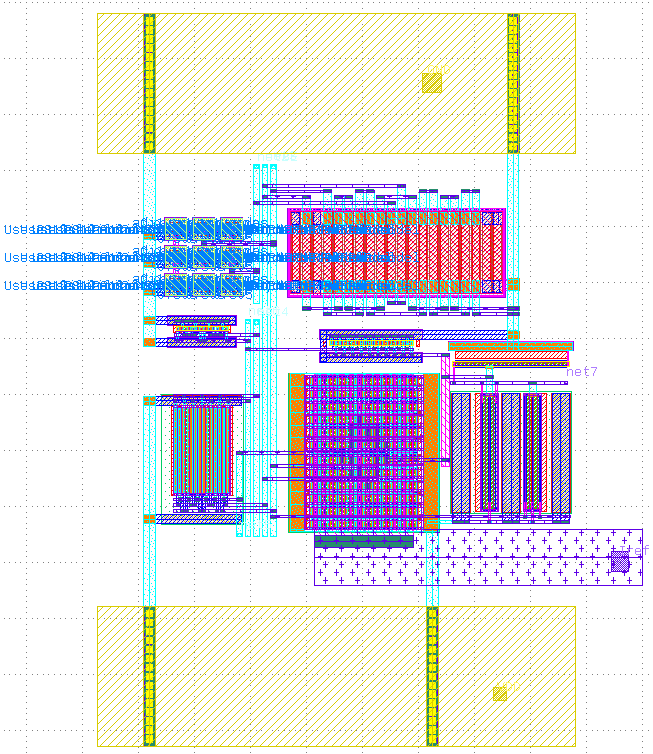

## Band Gap Refrence (BGR) 
----------------------------------

### Circuit design 
----------------------

* Proposed BGR circuit (Banba) :

* Core Circuit :

* OTA :

* Start-Up Circuit :

### Simulation results 
----------------------
#### Biasing Circuit  : Simulation of Banba Bandgap

Iref vs Temperature (-40 to 125 )

#### Transient Analysis

### Layout design 
----------------------

### Post-Layout simulation
----------------------

