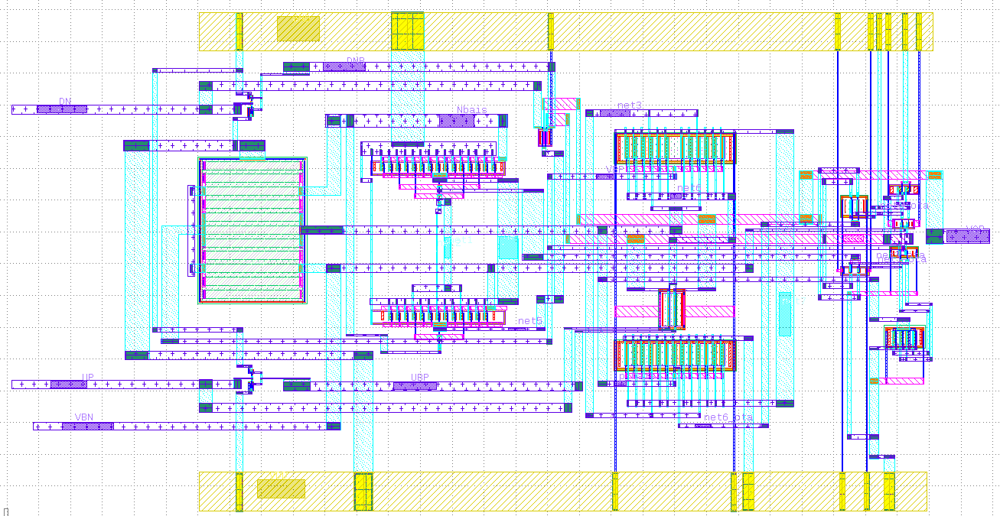

## Charge Pump (CP)
--------------------
### Circuit design 
----------------------
Type-I loop suffers from the trade-offs between the static phase error, loop bandwidth and stability. So, to solve this issue the charge pump is introduced. A charge pump is the first analog component of a PLL that will be considered. It is located between the PFD and the Loop Filter and responsible for placing charge into or taking charge out of the loop filter based on the output of the PFD, as it converts the up and down pulses into current pulses and these current pulses change voltage drop on the loop filter impedance which is the VCO control voltage. Charge pump must be very carefully designed to minimize reference feedthrough or phase noise since the noise generated by it affects the VCO noise.

#### CP operation  

 When the rising edge of the reference input REF leads that of the VCO feedback input FB, the PFD output UP is high and the CP delivers charges to the capacitors in the loop filter. Thus, the loop filter output voltage increases and so does the VCO output frequency. Therefore, the CP together with the PFD transfer phase difference into current.A good charge pump should feature equal charge and discharge currents, minimum switching errors such as charge injection, charge sharing, and clock feedthrough, and minimum output current mismatches. It utilizes a mismatch-cancellation circuit to reduce current mismatch. On the other hand, the mismatch-cancellation circuit senses any mismatch between charging and discharging current. Then according to this mismatch, the biasing of Idn is automatically adjusted so that discharging current Idn follows any change in the charging current Iup. At steady state, there is a very low mismatch between the charging and discharging currents.

#### CP design issues 

1. Current Mismatch
Current mismatch means that the up and down currents are not equal. Since the switches are basically PMOS transistor for the up switch and NMOS transistor for the down switch, there is a variation between up and down currents due to the different mobility of the P and the N Moses. This phenomenon leads to different Vcontrol for the same value of “up” and “dn”. So, if the current values Iup and Idn are not exactly same, or there is some delay between the controlled signals UP and DN, then there will be a natural phase error between reference frequency and output frequency of the VCO even if the PLL is in locked state.
To reduce current mismatch in the Charge pump there are several approaches that can be made. The output resistance of the charge pump can be increased by either using a cascode or a gain – boosting topology

	

2.  UP and DOWN skew
The arriving of UP and DOWN pulses should be guaranteed in order to open and close UP and DOWN currents simultaneously, if there is a skew between them his leads to ripples in Vctrl. But this problem is alleviated using the timing circuit as will be discussed. To solve this problem, we should normalize the delay of the up and down signals until they reach the charge pump so we can add a delay element to the down signal path such that it takes the same time to reach the NMOS switch.

3.  Voltage Compliance and Channel-Length Modulation.
The major challenge in the design of the charge pump is the channel length modulation. The VCO is controlled by the voltage generated by the charge pump and the loop filter. In order to have a wide tuning range for the VCO the voltage compliance of the charge pump should be maximized. But this gives rise to the problem of channel length modulation in the current sources. When the output voltage of the CP is high, Vds of the UP current source is low and Vds of the DOWN current source is high. Due to channel-length modulation, this makes the UP current smaller than the down current. And vice versa when the output voltage is low. This increases the current mismatch between the two currents.
* CP with unity gain buffer

We settled on the modified current steering charge pump with unity gain active amplifier because it’s very fast over the conventional single ended charge pump. We used a wide swing cascodes for up and down currents to minimize current mismatch and current variation with the control voltage. This unity gain amplifier buffers the voltage at the output node forcing the drain voltage of the current sources IDN and IUP to be the same when M1 and M2 are on or when they are off. This reduces the charge sharing effect, when the switch is turned on. This architecture ensures fast transient response through current steering, reduces the effect of any parasitic capacitance, at the expense of extra current.

* Charge pump circuit 

* OTA

### Simulation results 
----------------------

* Dn signal =VDD up signal =0

* DN=0 , UP=VDD

* DN=VDD , UP=VDD

#### Simulation Results across corners 
	
	1.  0.9VDD:VDD:1.1VDD (supply variations across corners)
	2. -40:27:125  (temparture variations across corners) 
	3. ss,ff,sf,fs,tt (process variations across corners)
	
*  Dn signal =VDD up signal =0

* DN=0 , UP=VDD across corners

* DN=VDD , UP=VDD

* Current variations less than +5% or -5% across corners. 

### Layout design 
----------------------

### Post-Layout simulation
----------------------

