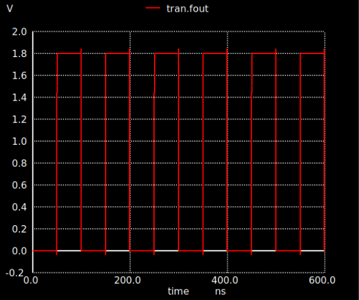

## Fractional Divider
----------------------

### Circuit design 
----------------------
#### Introduction
Frequency dividers are main blocks in a PLL system as they are responsible for obtaining the desired channel frequency at the output. Dividers have various classifications depending on its division ratio, the modulus may be fixed, dual-modulus, integer-N, or fractional-N. 
Proposed divider is fractional-N divider to satisfy the specifications of the project. How can we determine the divider topology, whether is fractional or integer?

If we have a look on the input frequency to the PLL, it is generated from a crystal oscillator with frequency 10 MHz. The output frequency is chosen to be from 2.4GHz to 2.48GHz covering all bluetooth channels, each channel is 1 MHZ. Consequently, the divider must obtain a division ratio from 240 to 248 by 0.1 step which indicates that the divider topology must have fractional-N modulus to cover all these division ratios.

Fractional-N dividers have a significant phase noise in the output of the PLL which is not desirable. high phase noise is mostly a result from the systematic switching of the division ratio of the divider each cycle.

DSM plays an important role in a fractional-N PLL, they are responsible for dethering the input control signal, randomization of the control signal, to shape the systematic phase noise generated from fractional-N dividers corresponding to switching in the division ratio each cycle.

#### Design 

There are many topologies to implement N-divider. Most common topologies are pulse swallow
divider, and multi modulus divider. Benefits of pulse swallow topology may be summarized in its ability to cover very large division ratios which exceeds N=1000 but at the cost of the power, and relatively limited speed compared to other topologies. Speed limitation in pulse swallow topology is a result of larges parasitic caps added by the 2 counters. On the other hand, MMD topology provides a better speed, power consumption. What does MMD mean? 

MMD is abbreviation of Multi-Modulus Divider. It is built from consequtive cells, each cell divides by 2 numbers do it is called dual-modulus which may be 2/3, 1/2, or any other combination. Most common cells in the MMD are 2/3 and 1/2 dual-modulus. Proposed implementation of our divider is MMD using 2/1 cells since it has a relatively better power consumption, phase noise.

 The structure of the proposed divider is depicted below,
 each 1/2 cell is designed using gates, and Flipflops. Proposed DFF is designed to be by dynamic CMOS DFF instead of static implementation because of better speed properties of the dynamic DFF rather than the static DFF.

Now, let us demonstrate how the N-divider acts as a 2/1 divider depending on its corresponding input signals. Starting with divide-by-2 mode, if P=0 or MODO = 0, the output signal of NAND gate I4 is 1. As a result, NAND gate I3 acts as an inverter, and the output frequency FO = FI/2. the equivalent. We must note that if there is a flip flop cascaded by an inverter, and the output Q is backed to the input D, the output frequency is half of the input clock frequency which is considered a by 2 divider topology.

If P =1, MODI =1, FO=1, and FI =1 before passing the line, that enables divide-by-1 mode. Both NAND gates I3, I4 are equivalent to 2 inverters or a buffer thus FO = FI/1. That occurs at the falling edge of FI which causes both MODO, output of the I1 block to be changed from 0 to 1. Hence, P, MODO, and I1 output equal 1.
It is worthy to mention the rule of the NAND gate I3 which gives the 2/1 cell the facility to obtain
simple operation, as well as low power consumption. The secret beyond its important rule, that NAND
gate I3 acts as a multiplexer to select either divide-by-2 or divide-by-1 mode by applying a logical function (P. MODO).

#### Divider Cell 

#### D-Flipflop design

#### NAND gate design

#### Inverter design

#### AND gate design

Control signals or P's have the main role of choosing the division ratio, each one is attached to a cell, so how many control signals we need for our PLL? 

divider output signal period follows the formula:

> Tout = [2n -2n-1 P(n-1) - 2n-2P(n-2) - ... - $2^0$ P0]Tin

In order to cover division ratios from 240 to 250, the number of cells must be 8 at least, so the max N is 256.

### Simulation results 
----------------------

Divider simulation has been done using various testing techniques. First of all, the divider is simulated at an input frequency of 2.5 GHz, and selected-N is 250. hence, the output frequency is expected to be 10 MHz. The figure below shows the transient output signal from the simulation with precise 10 MHZ frequency.

*Output transient signal at input freq =2.5 GHz & N=250*

### Layout design 
----------------------

### Post-Layout simulation
----------------------
