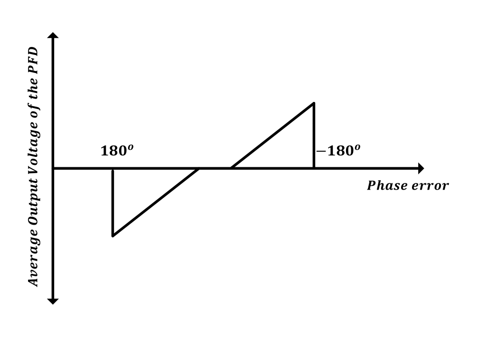

## Phase/Frequency Detector (PFD) 
----------------------------------

### Circuit design 
----------------------
First simple PLL employs a phase detector PD which fundamentally measures the phase error only and fails to generate a meaningful dc value when the frequency difference between output and input is large. A wide acquisition range is needed so that a PLL that locks regardless of the initial value of the output frequency can be developed. The simple PLL can’t achieve this. And simple phase detector can be as simple as an (XOR) gate or an (XNOR) gate.

* simple phase detector 

A phase detector produces an output signal proportional to the phase difference of the signals applied to its inputs. But Normal phase detectors faced many problems. For example, the nominal lock point with an XOR phase detector is at the 90° static phase shift point and the phase detector range is only 𝜋 Also, if there is a frequency difference between the input reference and PLL feedback signals the phase detector can jump between regions of different gain which cause cycle slipping phenomenon as the PLL is no longer acting as a linear system and if the frequency difference is too large the PLL may not lock
 
* Phase frequency detector

For these problems of simple phase detector. Phase frequency detector is used to overcome these problems and have wide acquisition range. Phase frequency detector is a block that detects the phase and frequency differences between two signals which are reference signal and feedback signal from the divider in our case. Phase frequency detector has potential over normal phase detectors as it can detect both phase and frequency differences and herefor it allows wide locking range for the PLL

This PFD generates an Up and a Down signal that switches the current of the charge pump. The DFFs are triggered by the inputs to the PFD. Initially, both outputs are low. When one of the PFD inputs rises, the corresponding output becomes high. The state of the finite-state machine (FSM) moves from an initial state to an Up or Down state. The state is held until the second input goes high, which in turn resets the circuit and returns the FSM to the initial state and illustrates a common linear PFD architecture using resettable DFFs.

* PFD design issues

1. Dead zone

	Dead zone is defined as the maximum difference in phase between the two inputs that can’t be detecte by a PFD. When the phase difference is very narrow, this 		requires narrow pulses by the PFD, but due to the propagation delay of the internal devices these narrow pulses will not be generated. 
	
	
	
	This can be avoided by some structures that remove the reset path, but these generated narrow pulses cannot activate the charge pump. So, the average output current will not follow the phase error and hence the transfer characteristics of the PFD and charge pump will exhibit a region of small or zero gain near the phase lock.Dead zone causes low loop gain and increases jitter and phase noise, so no dead zone is very important for better performance of the PLL. So, the solution is to insert a delay in the reset path.
	
	

2. Skew between UP and DOWN signals and mismatch between their pulse widths

	These two arise from random propagation delay mismatches and can be minimized through the use of large transistors and layout symmetry. But these two effects 	negligibly affect the performance.

3.  Blind zone

	due to the delay of the reset path, the linear range is less than 4π, which results in an insensitivity to some transitions in the input signal. This is called the blind zone, at which the PFD generates wrong polarity pulses leading to wrong behavior in the loop which increases the acquisition time. This effect appears when phase difference is larger than 2π − ∆ where ∆ = 2π ∗ treset/Tref . So, to eliminate the blind zone we have to eliminate the reset path which is not a choice in our case as stated in the dead zone section.
	
	

* PFD operation 

	

* the signal passes less gate for a high speed; on the other hand, the NOR gate can provide some delay to reduce the dead-zone. The operations of this PFD are very simple: when the input signal (REF) and the reset signal (RESET) are both low, node A is charged up to VDD though MP1 and MP2. At the rising edge of the signal, node B is connected to ground though MN2 and MN3, yielding the output signal (UP) to be HIGH due to the inversion. Then after that, node B is not affected by the input signal since charges at node A turn off MP3 and prevent node B from pulled up. Therefore, the output is always high after the rising edge of the input signal. When RESET is applied, node A is discharged to ground through MN1 and node B is pulled up though MP3, causing output UP signal to reset. The RESET signal is asserted when the second DFF input signal (FB) experiences a rising edge. When the PFD collects two rising edges the REF and FB, the NOR gate will assert the RESET signal and reset the output signals. The PFD is a 4-state PFD Since it has a state when the outputs are both high. The width of the reset pulse is determined by the delay in the NOR gate. The effect of this delay on the maximum operating frequency is discussed in the following subsection. In the design, the NOR gate has a delay of 150 ps.

* Conventional PFD

	

* PFD Implemented

	

* UP flip-flop 

	

* DOWN flip-flop

	

* NOR-Gate

	

### Simulation results 
----------------------

* REF lags from FB  by 1ns 

*  Another case when delay between Ref and Fb equals 0 (locking case)

* When  fB lags from REF  by 95ns

* When  fB lags by 50ps (small phase error)

* Reason for dead zone

the small phase error cannot be detected properly explains the reason for dead-zone: if the phase difference is small, the output pulses may not be able to activate the CP completely, yielding a zero PD gain and loop gain, and the loop is basically open and the PLL noise is the same as a free running VCO noise. Delay can be added at the reset path to avoid this issue.

#### Simulation Results across corners:
	1.  0.9VDD:VDD:1.1VDD (supply variations across corners)
	2. -40:27:125  (temparture variations across corners) 
	3. ss,ff,sf,fs,tt (process variations across corners)
	4. Ref_delay and FB_delay different cases {10n,0},{0,10n},{1n,1.1n}
	  

* Fb lags from Ref across corners

* REF lags from FB across corners

* When phase error is very small to  ensure that pulse width is sufficient for  Cp switching.  

### Layout design 
----------------------

### Post-Layout simulation
----------------------

