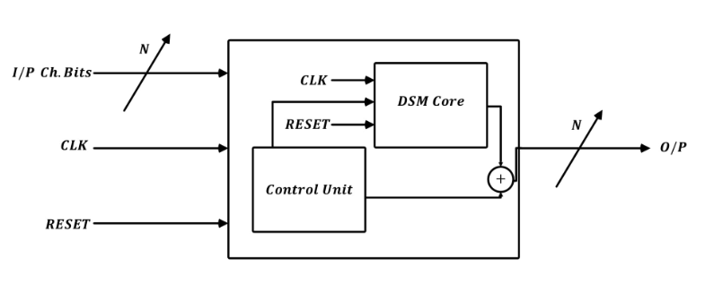
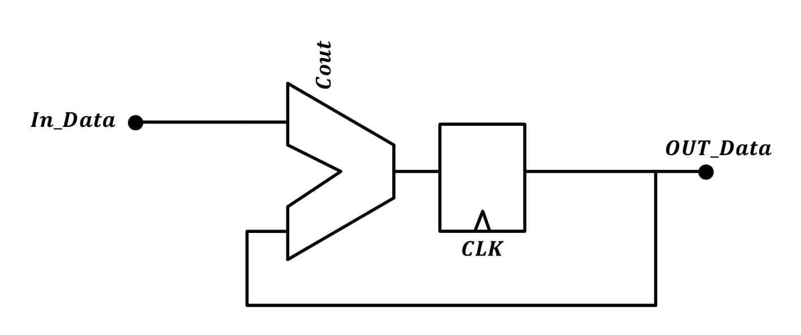
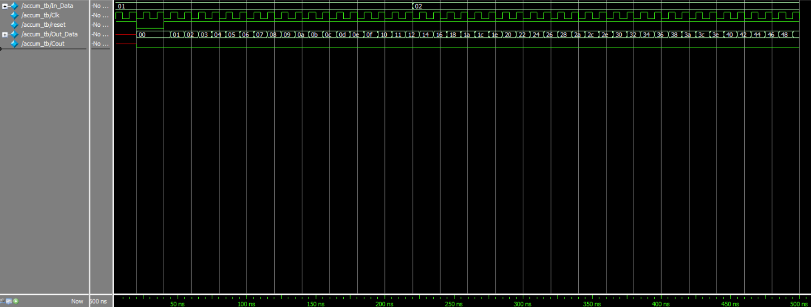
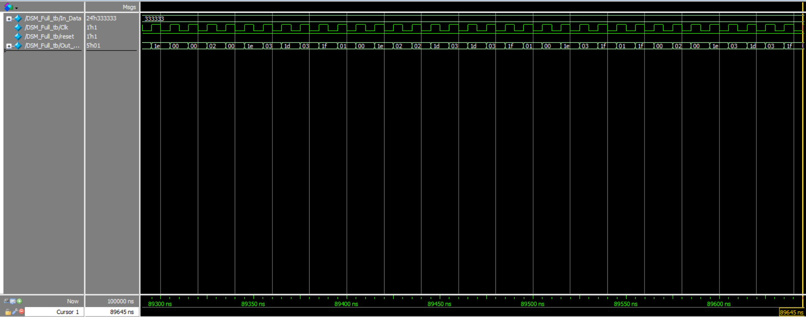
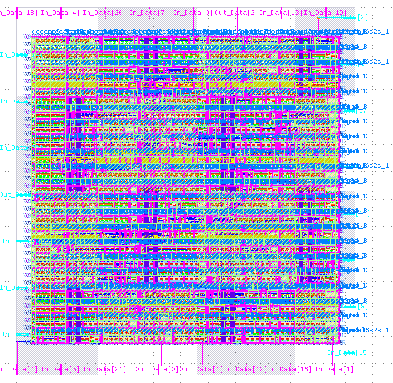

## Delta Sigma Modulator
-------------------------
### Introduction 
----------------------

- Digital Delta Sigma Modulators **(DDSM or DSM)** are widely used in fractional-N phase locked loops (PLLs) to be able to generate fractional multiples of the reference frequency. The core of a fractional-N PLL is similar to an integer-N PLL, but it incorporates the DSM and multi-modulus frequency divider in order to accurately interpolate between integer multiples of the reference frequency. The DSM quantizes digital N-bit DC input $X$ into an M-bit time-variant integer $Y$ in order to instantly modulate the programmable divider’s modulo $(N > M)$. On a long run, the average modulo becomes $(N + X/2^n)$, and the average of PLL’s output frequency $f_{vco}$ becomes the product of the reference frequency $f_{ref}$ and average modulo. The tuning resolution depends on the complexity of the DSM, so considerable flexibility and programmability is achieved. Since there are ***78 possible channels inside the Bluetooth frequency range, therefore 7 bits are enough to distinguish between them***. The DSM block has 9 input-bits and 1-output bit. The 9-input bits consist of 7 bits for channel selection, 1 bit as a clock for the registers inside the DSM and finally 1 bit to reset the registers at the beginning of the operation.

- **The implemented Sigma-Delta Modulator has the following inputs and outputs**:
  
      - Inputs:   → Input channel bits (7 bits): Used to select a certain channel.
                  → Clock (1 bit): Used for the registers in the design.
                  → Reset (1 bit): Used to reset the registers in the design.
      -----------------------------------------------------------------------------
      - Output:   → Output passed to the divider (5 bits).

- Delta sigma modulation is used to compensate for the fractional spurs. The basic concept is that the energy of the fractional spurs at lower frequencies is pushed out to higher frequencies by modulating the counter of a specific order. Higher order modulators push this energy out to higher frequencies. However in practice, they also cause fractional spurs at a sub-multiple (1/2 or 1/4) of where traditional fractional spurs would be if there were not sufficient filtering.

- Delta Sigma modulators, or DSM, are separated into two architecture types, MASH **(Multi stAge noiSe sHaping)** and MBSL **(Multi-Bit Single Loop)**. MASH modulators are easier to build and unconditionally stable. Unfortunately, they create more noise than MBSL and require more output states for the same division ratio. MBSL modulators create less noise; their noise shaping is more flexible and uses less outputs for the same division. However, MBSL modulators are complex and have some unstable inputs. 

- **In this work, a third order DSM of MASH architecture is designed and verified using Verilog HDL.**
  
### Architecture and Operation
----------------------
DSM mainly consists of three blocks , DSM core, Control unit and an adder. 

1. **DSM core**
is the block which is responsible for generating the random 5-bit streams. The average of these streams is the needed fractional part of the division ratio. 

2. **The control unit**
is responsible for two important tasks. Firstly, the control unit maps the input 7 bits representing the intended Bluetooth channel to the DSM core input. Secondly, it gets the integer part of the division ratio from the input channel number. 

3. **Adder** adds the integer part (control unit output) to the fractional part (DSM core out) in order to construct the required fractional division ratio which go to the multi-modulo divider. 

- **Following is an example to illustrate the operation of the DSM.**
  *If the input channel requires the divider to divide by 243.7, then the control unit will give the DSM core the input which gives an average output of 0.7. Moreover, this control unit will output a constant value of 13 which corresponds to a division ratio of 243. Then these two values, the 2nd output of the control unit and the output of the DSM core, will be added and then passed to the divider as an input to get the desired 243.7 division ratio.*

#### Digital Implementation of the DSM Core
----------------------
The typical implementation of a MASH architecture is composed of a number of accumulators, adders, and registers arranged as in the following figure. Each block will be reviewed in details through the following sections.

##### 1. Accumulator
The accumulator in this design has 3 inputs (In\_Data, CLK, Reset) and 2 outputs (Out\_Data, Cout) as shown in following figure. The size of the accumulators is of 24 bits to increase the resolution to obtain a precise fraction.

The following figure illustrates an example of the accumulator operation and results. At the beginning, the content of the registers is forced to store zero through the reset signal. This guarantees an expected behaviour of the accumulators. When the input of the accumulator turns into 1 then the accumulator content is incremented by 1. The incremental value remains the same as the input of the accumulator is not changed. Once the accumulator input is increased from 1 to 2, the accumulator content is incremented by 2 which is the expected and needed operation for the accumulator.   

##### 2. Special Adder
The following figure illustrates the function of the proposed adder. This adder simply adds 2 numbers and then subtracts a third number from them. Hence, it has 3 inputs and 1 output. 

The figure bellow shows an example of the special adder results.

### Simulation results 
----------------------
The figure bellow illustrates the results of the whole DSM including the control unit and the DSM core. The DSM works as expected when it generates a random sequence needed for the divider to select the intended Bluetooth channel. From the results, DSM starts generating random sequence at high time values. This issue is expected due to the large sizes of the accumulators. There is a trade-off between the respond time and the division ratio precision. The larger the accumulator size, the more accurate division ratios, the more time needed for the accumulator to overflow, then the slower the DSM to respond. A 24-bit accumulator is chosen for the sake of the accuracy.

### Layout design 
----------------------

### Post-Layout simulation
----------------------

