## Voltage Controlled Oscillator 
---------------------------------

### Circuit design 
----------------------
#### Introduction

An oscillator is an electronic circuit capable of producing a continuous, repetitive, and alternating waveform without any input. This waveform can be either Sine, triangle or even a saw tooth, but the sinusoidal waves are used the most in the RF applications especially in wireless communication systems to provide a local carrier to the mixer for up- conversion or down-conversion. Oscillators simply convert the unidirectional flow of current from a DC source into an alternating waveform of the desired frequency with high accuracy.  However, most RF applications such as RF transceivers, frequency synthesizers and PLLs need adjustable frequency signals hence the idea of the Controlled-oscillators.  A controlled oscillator can be either a current-controlled oscillator in which the frequency of the output signal can be controlled by changing the level of the input dc current, or it can be a voltage-controlled oscillator (VCO), in which case the output frequency can be adjusted by changing the value of the input dc voltage. Although current tuned oscillators are possible; They are not used very often due to difficulties in controlling the energy stored in the LC tank with current [^1].

There are different types of VCO circuits used in many applications, but they can be widely classified into two main categories based on the shape of the output voltage and the components used in their construction, relaxation oscillators and harmonic oscillators. Firstly, relaxation or astable oscillators, this family of oscillators are mainly depending on the concept of charging and discharging a capacitor through a resistor network in a specific configuration to generate the nonlinear square, triangular, or even sine oscillating signals with distortion of a few percent. The oscillation frequency of the relaxation family is determined by the RC time constant. This family is classified into emitter coupled VCO, grounded capacitor VCO and delay-based ring VCO which has the highest quality factor compared to the other relaxation oscillators. Secondly, harmonic or quasi-sinusoidal oscillators and can be called linear VCO as well, this family of oscillators produces sinusoidal output waveform. Crystal, RC, LC oscillators are examples of this category. In this VCO, voltage across the diode varies the varactor diode’s capacitance. Hence the varactor changes capacitance of the circuit thereby the frequency changes. Relaxation oscillators provide two major advantages over harmonic oscillators, wider frequency tuning range and smaller circuit area. However, with respect of phase noise, supply and temperature stability, the harmonic oscillators are much better than the relaxation oscillators [^2]. Therefore, taking into account the high value of the Bluetooth carrier frequency (2.35 GHz), the LC-type resonance VCO is selected to be integrated with the proposed PLL [^3].

#### LC Oscillator Concept 
The analysis and design of LC oscillators is mainly based on the characteristics and modeling of LC tanks especially the tank losses. There is more than one method, either in time domain or in frequency domain, that can be used to demonstrate that a tank LC produces an oscillating signal with a single frequency if biased with appropriate conditions.\\
Firstly, taking the case of an ideal LC tank with no losses which is not the practical case as depicted in :

(a) assuming an initial condition of $V_o$ across $C_1$ which allows the capacitor to store an electric energy of $(1/2) C_1V^2$. Then the capacitor $C1$ begins discharging through the inductor $L_1$ and so the electric energy is gradually being converted into magnetic energy of $(1/2)L_1I^2$ and stored inside the inductor $L_1$. At $t=t_1, V_{out}=0$ which means there is no electrical energy stored in the capacitor and all the system energy is coming from the magnetic energy stored inside the inductor. Hence, the current going through the inductor at $t_1$ can be obtained from the fact that the magnetic energy equals to the electrical energy of the capacitor at the initial condition.

$$(1/2) C_1V_o^2  = (1/2)L_1I(t_1)^2$$
  $$\ \ \ \ \ I(t_1) \ = \sqrt{C_1/L_1}V_o$$

After $t_1$, the voltage across the capacitor begins to increase than zero but in the negative polarity which allows the inductor current to flow the rough the capacitor charging it till $t=t_2$ at which the all the energy is returned back to the capacitor $C_1$ but with an opposite polarity of the voltage across the capacitor. Thus, the voltage across the capacitor is sinusoidaly repeated producing an ideal oscillator [^4]. The output voltage of the LC tank is sinusoidal as a result of solving of the inductor and capacitor differential equations together.

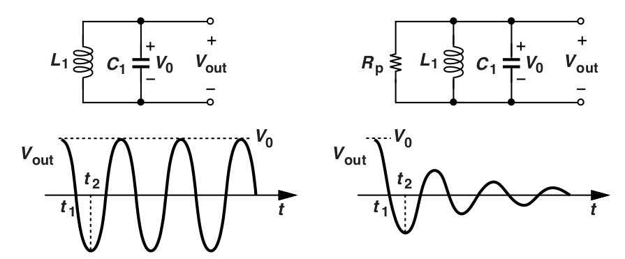

 (b) However, in the practical cases, the LC tank suffers from non negligible losses which can be modeled as a resistance shunt to the tank. This resistance is absorbing some current and dissipating energy which in turn decreases the inductor current at $t=t_1$ to be less than $\sqrt{C_1/L_1}V_o$. Thus, the tank peak voltage at $t=t_2$ is less than $V_o$ producing decaying oscillation In the integrated VCO, these losses are mainly comes from the on-chip spiral inductor and its routings in addition to the losses comes from the varactor.
Therefore, to achieve a sustain oscillating signal from the LC tank, a means of compensation is needed to make up for the energy dissipating through the tank losses. An extra circuitry is needed to provide the tank with the enough amount of energy which is greater then or at least the same as the dissipated amount. All the LC oscillator typologies are following the same criteria, providing an additional circuit whose impedance exhibits a negative real part to compensate the tank losses as depicted in Fig.\ref{negative res}. The negative resistance circuit is an ordinary transistor-based circuit at which the current going through its two terminals is inversely proportional to the voltage applied on these 2 terminals.

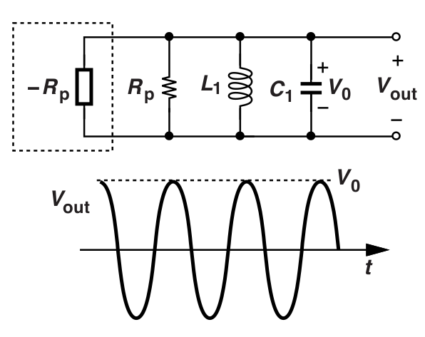

In fact, most of the LC  oscillator such as Colpitts, Pierce, Hartley, Clapp and cross-coupled LC oscillators objective is to balance the loss of the tank by implementing a negative resistance circuit. Colpitts is widely-used oscillator in both integrated and discrete circuits. It uses a positive capacitive feedback with a common gate configuration to implement the negative resistance. It is a very good choice for the single ended applications for the reason of simplicity, it consists of just one transistor. Hartley-based LC oscillator is the same as Colpitts except it uses inductive positive feedback instead of the capacitive feedback.The extra inductor in Hartley makes it a far option to the integrated LC VCO. Clapp oscillator is another version of Colpitts except that it uses an additional capacitive divider as which in turn allows the signal across the inductor to exceed the value of the transistor drain or source. Thus, a larger swing is achieved and so a better phase noise. Cross-coupled LC oscillator is an example of the differential LC oscillators. An apparent benefit of the cross-coupled oscillator is that it has higher transconductance  than the Colpitts oscillator, thus it requires less power than the Colpitts oscillator needs to produce the same transconductance. This issue is exacerbated in the integrated circuits as the quality factor if the LC tank is significantly a small value and thus requires high values of the transconductunce to satisfy the condition of oscillation. Therefore, the Cross-coupled LC oscillator is selected in this proposed work as it is the best option for the integrated VCOs in terms of power,area and phase noise[^5].

Colpitts        |  Pierce
:-------------------------:|:-------------------------:
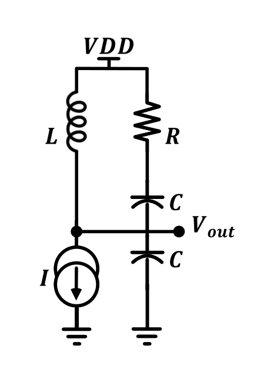  |  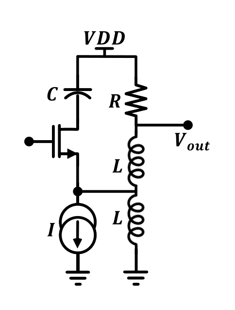 
Hartley   |  Clapp and cross-coupled
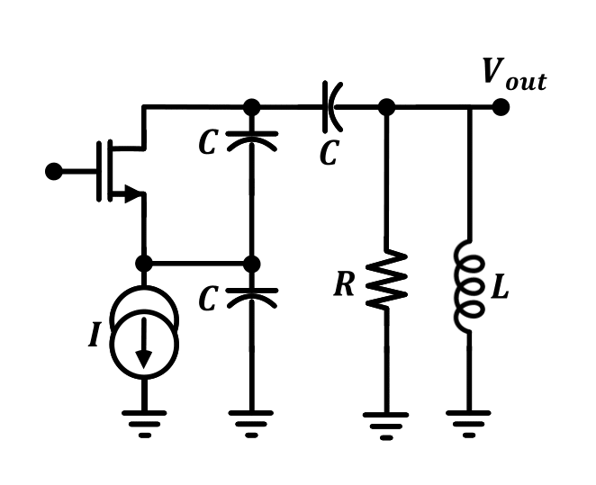  |  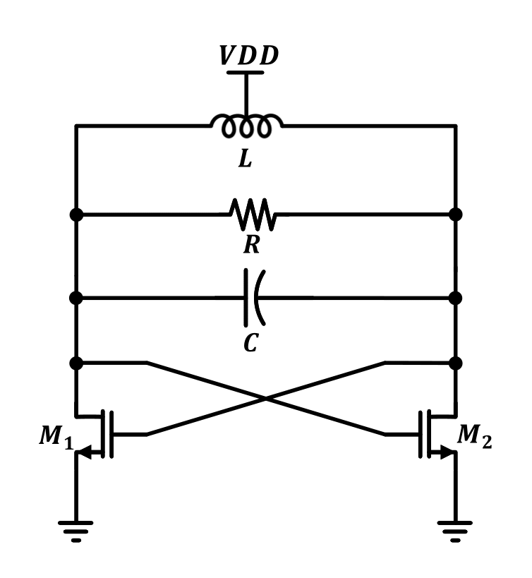 

#### Performance Metrics

Quantifying the performance of a VCO involves a lot of performance parameters such as: tuning range, phase noise, jitter, power consumption, gain, stability and center frequency. These parameters are heavily dependent on each other giving rise to various trade-offs encountered during the design process. A reasonable compromise between these parameters can be obtained to achieve an acceptable response that satisfies the target specifications as will be shown in the next sections.

#### Tuning Range (TR)

Highest and lowest frequency a VCO can generate an oscillating signal with are defining the tuning range of a such VCO. It is very important quantity for a VCO and one of the first specs the designer tries to achieve. The value of the TR depends on the application, which is 200 $MHz$ in the case of Bluetooth channels. It is usually evaluated relatively to the center frequency in mm-wave oscillation.

$$TR(\%) = \frac{\Delta f}{f_{center}} \times 100$$

Where TR is the tuning range, $\Delta f = f_{max} - f_{min}$ and $f_{center} = (f_{max} + f_{min})/2$. To vary the LC VCO frequency within the TR, the vcricap is used to control the capacitance of the LC  tank and so controlling the oscillating frequency. Therefore, it is very useful for the designer common sense to formulate the TR in terms of the $C_{max}$ and $C_{min}$ of the varactor as shown in the following equation 

$$TR(\%) = \frac{\sqrt{\frac{C_{vmax}}{C_{vmin}} + \frac{C_{fix}}{C_{vmin}}} - \sqrt{1 + \frac{C_{fix}}{C_{vmin}}}}{\sqrt{\frac{C_{vmax}}{C_{vmin}} + \frac{C_{fix}}{C_{vmin}}} + \sqrt{1 + \frac{C_{fix}}{C_{vmin}}}}$$

Where $C_{vmax}$ and $C_{vmin}$ are the maximum and the minimum capacitance values of the varactor. The $C_{fix}$ is the fixed capacitance of the LC tank which takes into account the parasitics as well. Theses parasitics come from the transistors used in the negative resistance circuit and the overlapping capacitors between the metal wires used in the layout. The more theses parasitics, the less the TR and the less the operating frequency itself. Thus, it is important, especially in the mm-wave applications, to be very careful of transistor sizes and their added parasitics [^6].

#### Phase Noise (PN) and Jitter

The ideal oscillator, which does not exist practically, generates a sinusoidal signal oscillating perfectly at a single frequency of $f_o$ with a constant amplitude of $V_o$ as described in equation \ref{idealoscillator equation}.

$$V_{out}(t) =  V_ocos(2{\pi}f_ct),$$

Thus, the frequency spectrum of that ideal generated signal will be impulse at $f_o$. The zero crossing of that signal generated from the ideal oscillator happens at integer multiples of $T_c$ 

$$T_c = \frac{2{\pi}}{w_c},$$

where $w_c$ is the center frequency of oscillation and $T_c$ is the time period.
In reality, due to the unavoidable noise sources in the circuit, the zero crossing of the signal does not happen at the integer multiples of $T_c$ which disturbs the phase of the generated signal and produces time domain jitter. These disturbances are function in time and can be modeled as shown in equation called phase distrubance

$$V_{out}(t) = V_ocos[(2{\pi}f_ct) + {\phi}_n(t)]$$

Therefore, the output spectrum is contaminated with unwanted frequency components generating symmetrical perturbations around the center frequency $f_c$ produces phase noise. Thus, jitter in time domain relates to phase noise in frequency domain [^6].

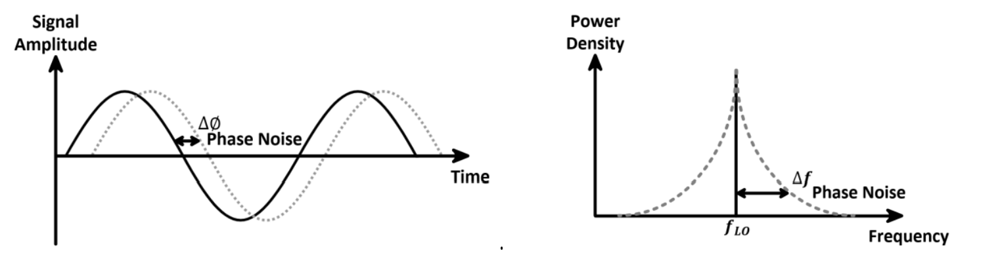

Phase noise represents the measurement of how far the intended signal is from that generated by an ideal oscillator. It determines the spectral purity of the output signal and quantifies the amount of the unwanted frequency components associated with the desired carrier signal. Phase noise is typically described as a single side-band (SSB) phase noise and denoted as $L(f)$. Its classical definition is the ratio between the power density of the output spectrum  within a window of 1 hertz bandwidth measured at an offset frequency from the carrier and the carrier power. Thus, it is expressed in units of $dB_c/Hz$ 

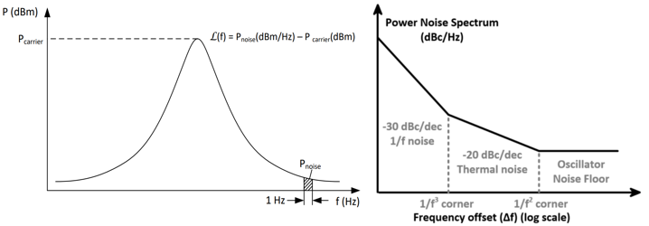

The relationship between the phase noise of a practical oscillating signal and the offset frequency. It is clear that the near-carrier spectrum consists of three specific regions. The region closest to the carrier frequency suffers from a $1/f^3$ roll off and is commonly referred to $1/f^3$ region. Beyond that region, the slope changes to $1/f^2$  roll off and is referred to $1/f^2$ region. The edge between these two regions is referred as the $1/f^3$ corner. Finally, at far displacement from the carrier, the spectrum tends to flatten out. This phenomenon is typically a consequence of the noise floor of circuits in the system.

Many theoretical attempts have developed to formulate the phase noise phenomenon in a single equation which ease the design of the oscillators in the basis of the phase noise trade-offs. Leeson's formulation is considered one of the pioneer methods in formulating the phase noise [^7]. Based on  Lesson's equation, an empirical formula for the  phase noise of an LC feedback oscillator is described in equation\ref{lesson equation}.

$$L(\Delta{w}) = 10log[\frac{2FK_BT}{P_{sig}}(1+[\frac{w_o}{2Q\Delta{w}}]^2)(1+\frac{\Delta{w_{1/f^3}}}{|\Delta{w}|})]$$

where $\Delta{w}$ is the frequency offset at which the phase noise is calculated, $w_o$ is the carrier frequency, $k_B$ is the Boltzmann constant, T is the temperature in kelvin, $Q$ is the quality factor of the LC  tank, $P_{sig}$ is the signal power, $F$ is an excess noise factor accounting the additional noise comes from the other circuit components and $\Delta{w_{1/f^3}}$ is the $1/f^3$ corner. The previous equation states a very important concept for the LC oscillators, which is that the phase noise of the oscillator is highly depending on the quality factor of the tank. Unfortunately, the quality factor of the LC oscillator is limited to less than 20 at lower GHz frequencies. 

#### Power Consumption

The minimum power an oscillator needs to oscillate as intended is depending on many factors and specifications of the oscillator itself. There is a very crucial trade-off between power, tuning range, and phase noise that a designer experiences when trying to design a simple LC VCO oscillator which makes the design of the LC VCO a very critical process. Since the supply voltage is fixed, then the power consumption of the LC VCO is directly affected by the current going through the negative resistance circuit or its trans-conductance($Gm$). First trade-off is the one between power consumption and the tuning range ($TR\%$), the higher the inductor, the higher the series losses of the inductor, the higher the parallel losses of the inductor which requires lower $Gm$ from the negative resistance circuit has to provide, the lower the current needed and finally the lower the power consumption to meet the specs. On the other hand, higher inductor means higher parasitic capacitance associated with the inductor. These additional parasitics increase the $C_{max}$ of the circuit and so reduce the maximum frequency and so reduce the tuning range. Thus, there is an inverse relationship between power consumption and the tinning range. Secondly, there is a very important relationship between power consumption and the phase noise which is a very critical quantity in communication applications. The swing of the oscillating signal is directly proportional to the power consumed in the oscillator. In addition to that, higher  swing oscillations exhibits lower phase noise. Thus, there is an inverse relationship between power consumption and the phase noise.

#### LC VCO Selected Topology

As mentioned before, the Cross-coupled LC VCO is the choice due to its easy starting up as well as providing a good compromise between phase noise, power consumption and tuning range in the integrated VCOs. The cross-coupled topology itself contains variant structures (NMOS, PMOS and CMOS cross coupled), the designer has to choose the best structure that fits the required specifications.

NMOS only

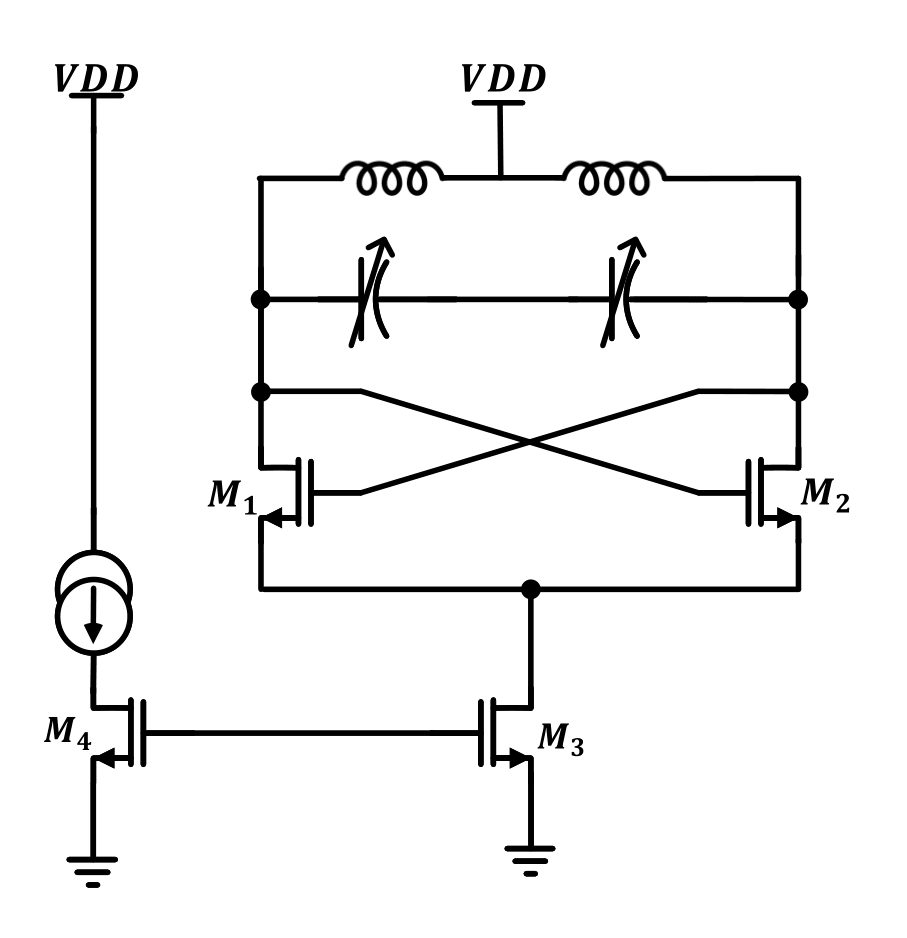

PMOS only

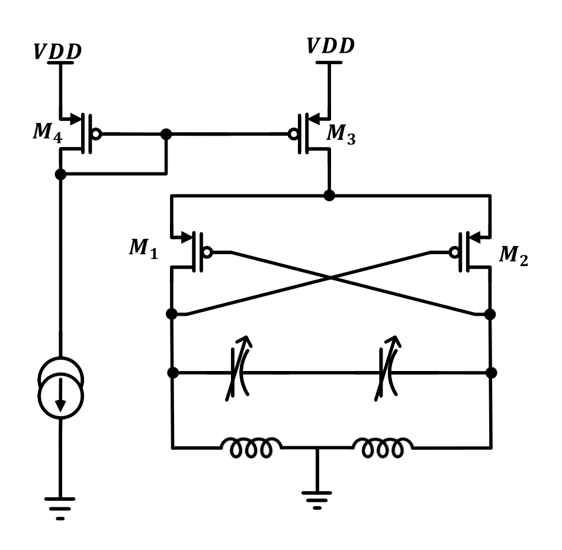

NMOS and PMOS

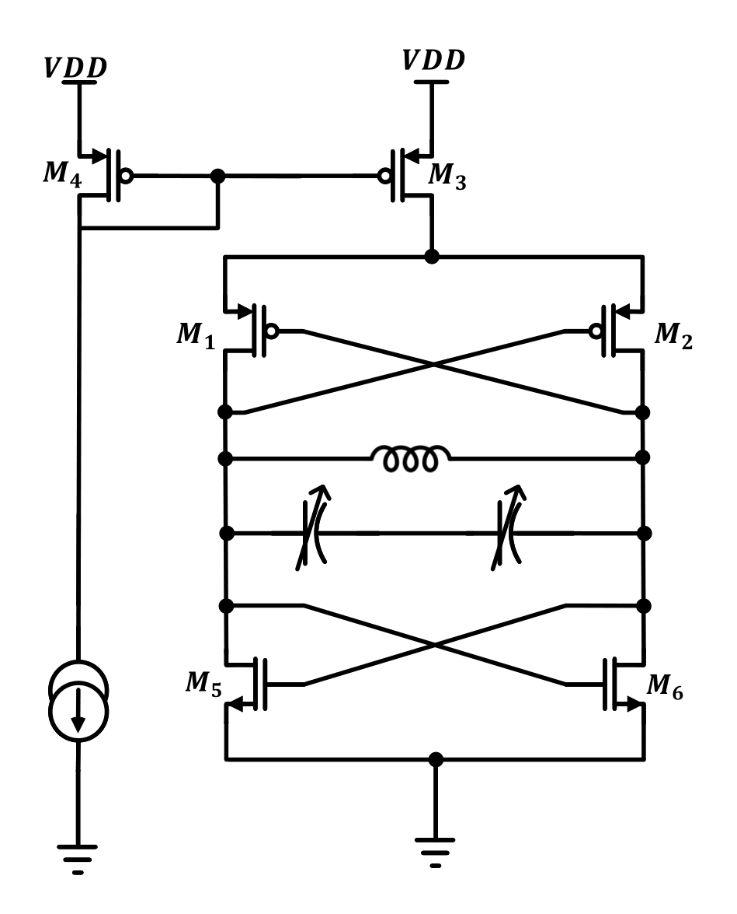

The NMOS topology  has the smallest sensitivity to ground noise but higher sensitivity to noise coming from power supply. Thus, it suffers from frequency pushing, which means that the oscillating frequency of the vco changes due to the change in the supply voltage level even if the control voltage remains constant. Moreover, as the inductors are connected to the supply voltage a,this structure can achieve an output signal swing twice the power supply voltage. This feature can lead to a phase noise reduction, since noise is strongly dependent on the oscillation amplitude.

For the PMOS topology,to carry the same current and provide the same trans-conductance the NMOS topology provides, the width is increased by a factor of 2-3 than the NMOS width due the fact that PMOS transistor is not as fast as NMOS transistor. Therefore, the PMOS cross coupled topology acquires higher implementation area. On the other hand, PMOS topology is less vulnerable  to the flicker noise and more robust against the supply noise.

A complementary LC VCO combines NMOS and PMOS. It combines the feature of both PMOS only LC VCO and NMOS only LC VCO taking advantage of the best performance of each one. This type of structure has as main advantage the reduction of the power consumption to half when compared to those in Fig(a,b). Moreover, one of the advantages of this topology is that the voltage swing is clipped to VDD by PMOS and to the ground by NMOS and hence it provides a voltage swing between ground and VDD. This is important because higher voltage swing induces stress in the transistors which can lead to reliability issues. One more advantage is the fact that this is more attractive to CMOS technologies because it shows immunity against process variation due to the presence of both the devices. The rise and the fall symmetry reduce the $1/f$ noise upconversion. One of the obvious disadvantages of this device is the increase in area due to the increase in the transistor counts but it is not significant as the size of the design is largely inductor dominated. Also, this structure may result in larger noise due to the existence of more noise sources[^8]. Based on all the above, the complementary-Based LC VCO topology with PMOS current mirror has been chosen and design for the proposed PLL as illustrated in the comming sections. 
A Complementary-Based LC VCO topology with a PMOS current mirror

#### Design Procedure

Based on the proposed lineup system analysis mentioned in section 3, the voltage controlled oscillator is supposed to meet certain specifications in order to achieve the desired performance from the PLL chain. Table \ref{vco specs} shows the required specifications for the voltage controlled oscillator.

| Spec      | Target         
| ------------- |:-------------:
| Tuning Range(%)   | 8.16 % 
| KVCO        |  300 MHz/V  
| Fmin | 2.55 GHz
| Fmax |12.35 GHz  
| Phase Noise at 1 MHz offset | -100 dBc/Hz  
| Phase Noise at 2 MHz offset | -100 dBc/Hz  
| Phase Noise at 3 MHz offset | -100 dBc/Hz    
|  Power| -    
|  Area| -    
|  VDD| 1.8V    
|  BGR current| 85 uA    

The full schematic for the proposed voltage controlled oscillator. The design process is splitted into 5 separate design steps (VCO core, current mirror circuit, varactor, inductor and buffer) to make the design process modular and more easier.

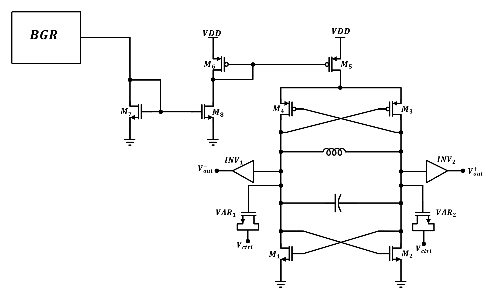

#### Design Of VCO Core

VCO core is considered to be fully designed when the sizing of the four cross-coupled transistors is selected. Thus, there are 4 different variables have to be chosen($L_1,L_2,W_1,W_2$). The length of ($M_1\&M_2$) is chosen to be minimum ($0.15 um$) to increase the gm and decrease the parasitics and so make it more possible to increase the varactor size for the sake  of increasing the tuning range. This reduces the number of the variables to just 2 which are ($W_1\&W_2$). There is no specification on the power consumption of the proposed PLL. Therefore, the current source will be a designer selection. The swing value of the output oscillating signal is proportional to the multiplication of the LC tank losses and the current going through the negative resistance circuit ($R_P*I_{SS}$). The value of the current source has to be selected carefully to achieve a reasonable compromise between power consumption, tuning range and phase noise, however the power consumption is the least priority quantity as there is no spec on it. Higher current means larger transistor sizes and then higher phase noise. Lower current means larger inductance and larger added parasitics and then lower tuning range. Therefore, the tail current source is selected to be $2mA$ which gives good compromise between phase noise and the tuning range. To satisfy the oscillation condition, the active conductance has to be larger than the passive conductance by a factor of more than 3, it is highly recommended to be around 5. Therefore, the gm/id value of the transistors has to be large enough. After some iterations, it is found that the suitable value for the gm/id is to be a higher than 10 which makes the active conductance larger than the passive conductance by a factor of 5 at least. There are 2 strategies while selecting ($W_1\$W_2$). Firstly, obtaining ($W_1\$W_2$) from the $g_m/i_d$ charts using the proposed vales of ($L\&g_m\&i_d$). At this technology, the PMOS size has to be at least 4 times the size of the NMOS transistor to exhibit equal $g_m$. The good thing of that method is that $g{m1} = g_{m2}$ which results in phase noise enhancement. Second method depends on not designing for same $g_m$ for PMOS and NMOS but the design depends on selecting the size of the PMOS  not much higher than that of the NMOS (for example $W_1 = W_2$). The latter method makes the dc level of the output signal around $VDD/2$. Therefore, the oscillation frequency curve versus the control voltage will be centered around $VDD/2$.

#### Sizing the negative resistance providing transistors (M3:M6)
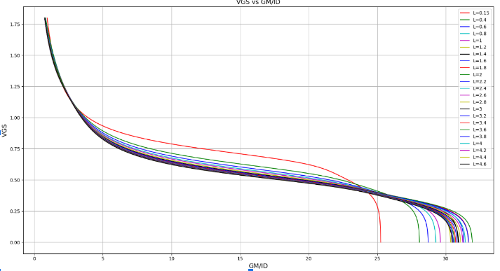
#### Design Of Current Mirror Circuit
The current mirror circuit can be either NMOS  type and connected to the NMOS  cross-coupled transistors or can be PMOS type and connected to the PMOS cross-coupled transistor as shown in Fig\ref{cmos lc vco}. Each topology provides different type of noise isolation. NMOS  current mirroe is more robust against the ground noise, on the other hand PMOS (which is the case) current mirror is more robust against the supply noise.
To reduce the phase noise value as can as possible, the voltage swing has to be the higher possible value maintaining the transistors operation at saturation region which is the current-limited regime. At the current-limited regime, the voltage swing is strongly linearly proportional with the current value. Then to have the most higher possible swing in the linear region, the circuit has to be operated at the end of the current-limited regime and the tail current source transistor has to be biased at the edge of the saturation region.The circuit is biased to make the current source of 2mA at the end of the current-limited regime satisfying the best phase noise value.

The current mirror topology used is the simplest and not the most accurate one due to the VDS mismatch. In addition the tail transistor is biased at the edge of the saturation. Therefore, the current mirror efficiency will not be good. To compensate that problem, the length of the current mirror transistors are chosen to be large ($0.5 um$).

#### Design Of Inductor

The on-chip spiral inductor presents some sources of losses which in turn contribute to the deterioration of the quality factor. The first type of loss is related to the resistance of the metal routing used to connect the inductor with the other circuits and the metal the inductor itself is made of. This loss is quantified as sheet resistivity. Another source of resistive losses is the skin effect as the higher the frequency, the more the current tends to flow at edges of the metals which. This type of losses is increasing as the frequency increases. The second type is based on the parasitic capacitance between the inductor and the metal routing and the lossy substrate material underneath it. This capacitive value decreases as the distance between the inductor and substrate increases.The third type of loss is related to magnetic coupling between the on-chip spiral inductor structure and the substrate underneath it. Accordingly, on-chip spiral inductors are usually implemented with the top and thickest layer which is metal 5 in this case. In order to model the resistive and capasitive losses of the actual inductor during the design process, ASITIC CAD tool is , which is developed by DR.Niknejad,   To model and consider the losses of the actual inductor while designing the voltage controlled oscillator, ASITIC CAD tool (which is developed by Dr.Nikneijad) is used to build up the actual inductor and extract its losses represented in pi-model. The provided ASITIC tool does not contain differential (center-tapped) spiral inductors, thus a single ended octave spiral inductor is used [9]. This used inductor provides a single series resistive load. To guarantee that the circuit would operate correctly via all the possible conditions, the proposed voltage controlled oscillator is tested twice. First simulation considers the unbalanced load as a single resistor on the right terminal of the inductor. Second simulation considers the unbalanced load as a single resistor on the left terminal of the inductor.The voltage controlled oscillator is operating as expected in both tests as will be shown in the results section.

Right terminal of the inductor      |  Left terminal of the inductor
:-------------------------:|:-------------------------:
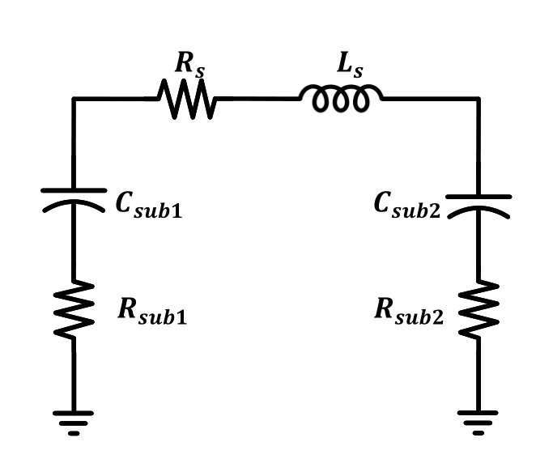  |  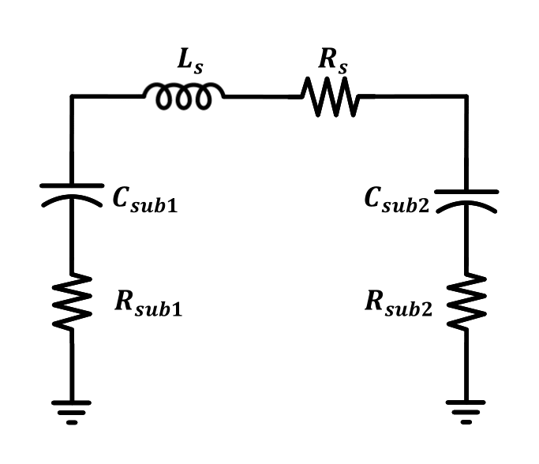 

where $L_s$ represents the inductance along the spiral inductor, $R_s$ represents the associated loss, $R_{sub1},R_{sub2}$ represent losses within the substrate material and $C_{sub1},C_{sub2}$ represent the parasitic capacitance between the inductor metal routing and the substrate underneath it.
As mentioned before, there is a relation between the inductor losses, swing amplitude and the value of the current going through the negative resistance circuit as shown in equation\ref{swing equation}. Since the value of the current equals $2mA$, the inductance value can be calculated ($L_s = 4nH$ for $Q=10$ and $V_{PP} = 3V$).

$$V_{PP} = (8\pi)*R_{P}*I_{ss}$$

$$R_P = R_s*(1+Q^2)$$

#### Design Of Varactor
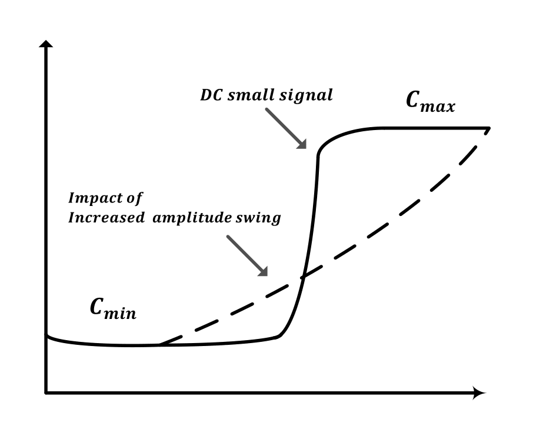
The MOS-varactor is used to act as a voltage controlled capacitor because  it provides a good tuning range for the low voltage circuits. Basically, to use the MOSFET transistor as a varactor, its source and drain terminals are connected to each other providing one terminal of the varactor. The other terminal of the varactor is the transistor gate itself. There are four regions for the MOS-cap to operate depending on the transistor biasing which are accumulation, depletion, weak inversion and strong inversion region. From the perspective of the VCO, it is desired to operate within the most linear monotonic capacitance portion of the $C-V$ curve for the sake of smoother $K_{VCO}$ response and so more stability. A comparison between the four MOS-cap topologies is performed to select the most appropriate topology.The bulk connection and transistor type is what differentiate between these four topologies. The bulk can be connected either GND or VDD or the drian-source terminal.

The $C_{GG}$ curves for the four topologies are plotted as shown, to select the most appropriate topology with the voltage range comes from the loop filter. As the loop filter is what providing the voltage controlled oscillator with the needed control voltage to control the capacitance value of the varactor and then control the output oscillating frequency.

     | 
:-------------------------:|
(a) $C_{GG}$ curve for first topology |
(b) $C_{GG}$ curve for second topology |
(c) $C_{GG}$ curve for third topology |
(d) $C_{GG}$ curve for fourth topology |

$C_{GG1}$ and $C_{GG3}$ curves are compatible with the voltage range supplied from the charge pump ($0:VDD$) and have the most linear characteristics between the four topologies. Therefore, the varactor choice will be either the first or the third topology. The third topology ($C_{GG3}$) provides higher tuning range than the first topology ($C_{GG1}$) for the same voltage range and same varactor sizing but its linearity is lower than the linearity of the first topology ($C_{GG1}$). Since the linearity difference between the first and third topologies is not significant. Moreover higher tuning range of third topology means that this topology can achieve the same tuning range of the first topology at smaller varactor sizing, hence lower phase noise. Thus the third topology (at which NMOS transistor is used with bulk connected to GND) is selected for the proposed voltage controlled oscillator. A constant MIM cap of 300 fF is connected in shunt which represents the most contribution of the capacitance needed for the bluetooth frequency range. Therefore, the size of the NMOS varactor is minimized for the sake of the phase noise.

#### Design Of LC VCO Buffer

A buffer stage between the VCO and the divider is needed to isolate the capacitive loading of the divider from the VCO output. The buffer circuit is composed of a simple CMOS inverter sized appropriately to minimize the delay. Hence the polarity of the oscillation signals is reversed, but it is not an issue. Since the divider input is single ended and the VCO output is differential ended, then only one terminal of the VCO is connected to the divider. Therefore, to guarantee the symmetry between the VCO differential output, a dummy inverter is connected to the unconnected terminal of the VCO.

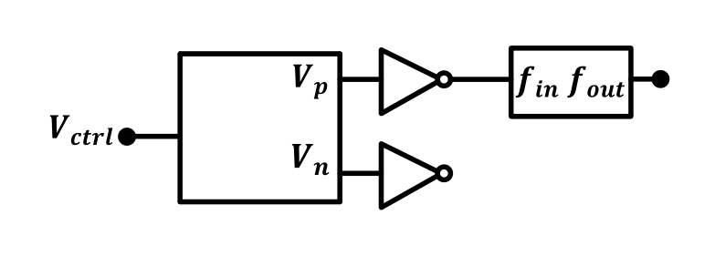

### Simulation results 
----------------------
#### CM output @ Vcontrol = 0.26 V , Frequency = 2.35 GHz 
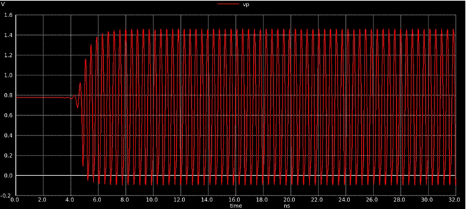
#### Differential output @ Vcontrol = 0.26 V , Frequency = 2.35 GHz
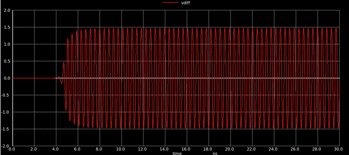
#### Differential output @ Vcontrol = 0.92 V , Frequency = 2.55 GHz
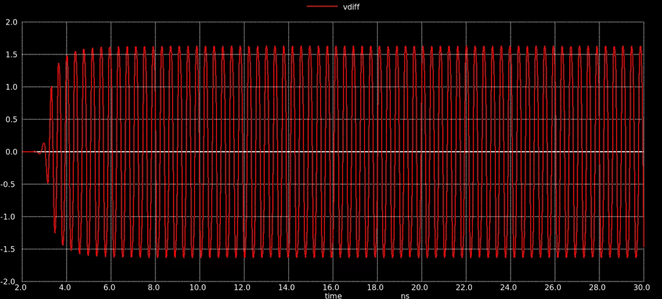
#### Oscillation Frequency - Typical

* Vcontrol range 0.26:0.92 V
* Fosc range 2.35:2.55 GHZ
* The curve is linear at most regions of the the tuning range

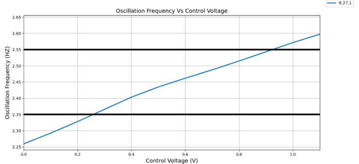

#### KVCO

* The KVCO is around 300 MHZ/V 

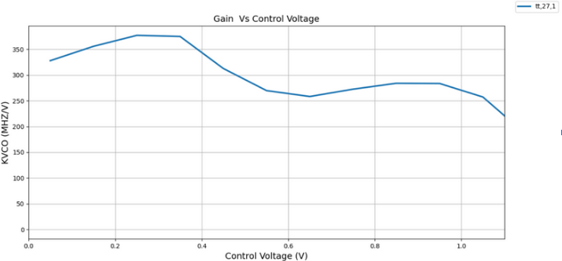

#### Corners

* By taking into account all the possibilities, we get 45 possible corners as shown in the following image. 

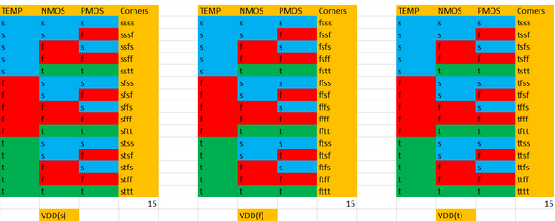

#### Oscillation Frequency 

The required tunning range is achieved

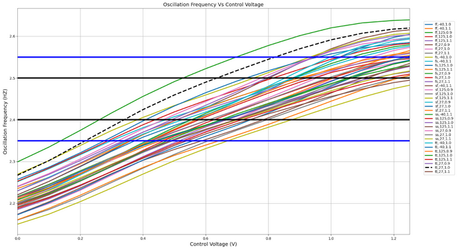

#### KVCO

The required KVCO is achieved

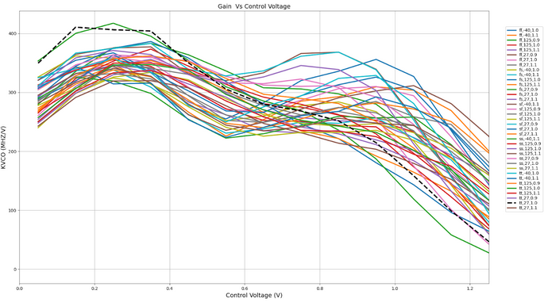

#### Diffriential swing level

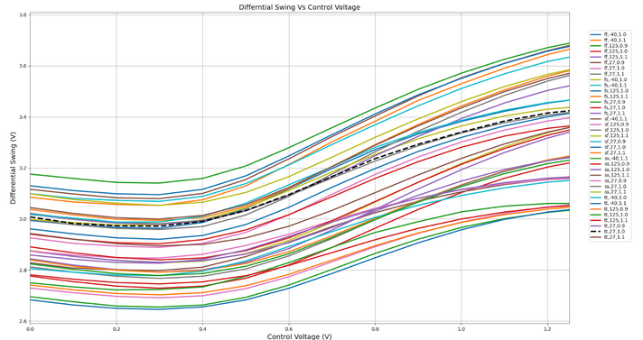

### Layout design 
----------------------
In VCO design, layout is very critical, a good layout aims at minimizing parasitics, which would introduce losses. The main contribute to the losses is the ohmic losses due to the resistance of the interconnections. To reduce the resistances of the metal wires, there is a need to increase their width, especially the ones which carry large currents, but this increases the parasitic capacitances of these wires. This introduces a new challenging design trade-off. The most critical nodes are VCO outputs, hence their connection widths are selected carefully to achieve the balance between the added looses, current capability and associated parasitics. Since the VCO provides $1mA$ at each output branch, therefore, the widths are increased to be able to provide that high current. Moreover, since the varactor does not consume current, hence the widths of the varactor branches are decreased to minimize the associated parasitics. All the previous details are in the layout of the VCCO without the inductor.

The above figure shows the layout of the proposed VCO. The layout was optimized to occupy the least possible area and being able to provide the VCO output high currents. The total area of the VCO layout is $648*538 um^2$ after optimization which is a reasonable area. Design rules check (DRC) was performed to verify that the layout is free of design rule violations and is suitable for fabrication. Parasitic Extraction of the whole layout performed to include the effect of the transistors and
interconnects associated parasitics

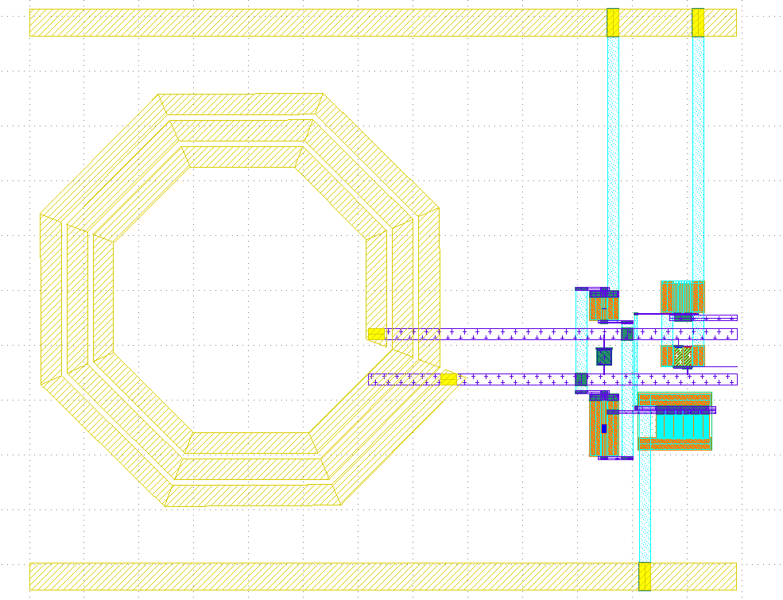

### Post-Layout simulation
----------------------

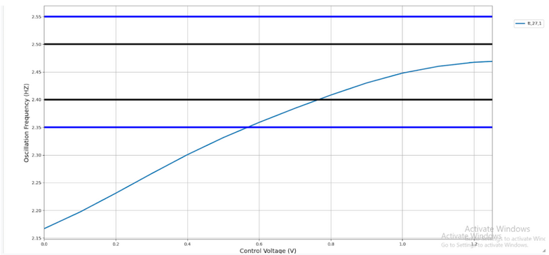

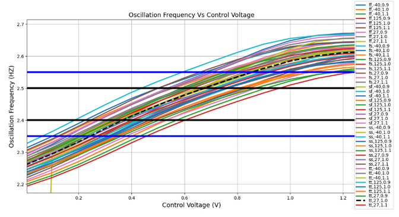
