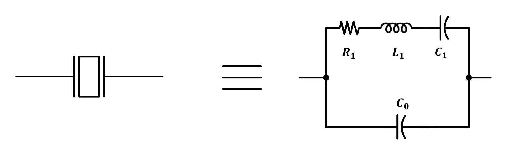
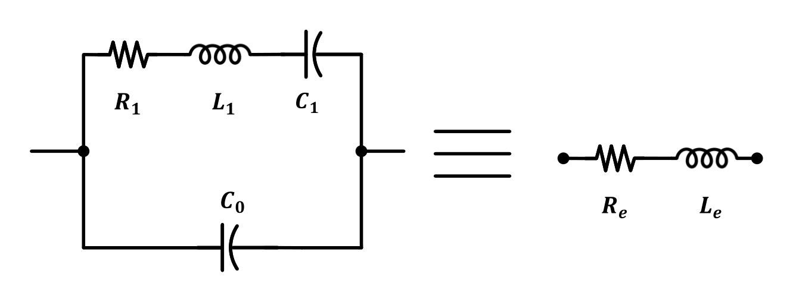
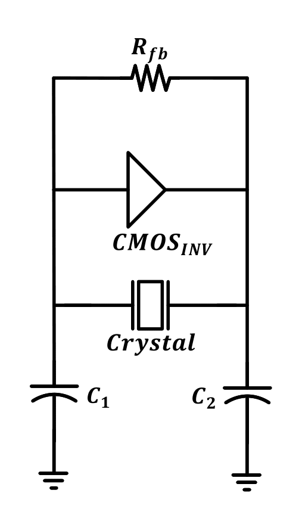
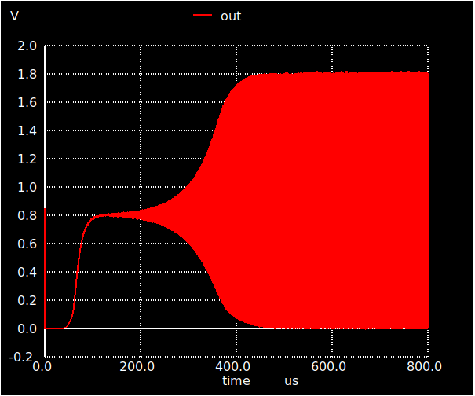
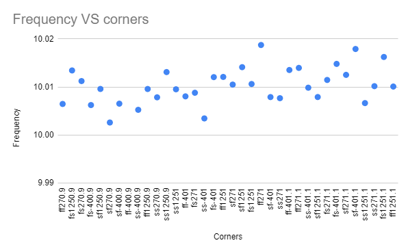
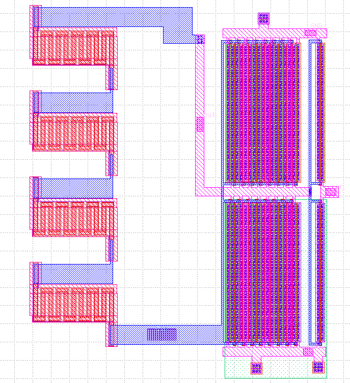
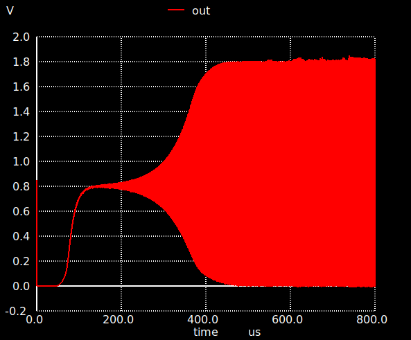

## Crystal Oscillator
----------------------

### Circuit design 
----------------------

#### Introduction

A crystal oscillator is a circuit that uses a piezoelectric crystal (usually a crystal) as a frequency selective element. The crystal vibrates mechanically as a resonator and its vibration frequency determines the oscillation frequency. Crystal oscillators have much better frequency stability than LC or RC oscillators because crystals have a very high Q-factor and also have better temperature stability than tuned circuits. The most widely used application of crystal oscillators is the reference clock of PLL.

#### Basic operation

Crystals can be modeled [^1] using the following simplified equivalent circuit shown in Fig

where $R_1$, $L_1$ and $C_1$ represents the heat losses, crystal mass and crystal elasticity, respectively. while $C_0$ represents the capacitance associated with the crystal and its adherent electrodes plus the internal stray capacitance. 
Its value is usually mentioned in crystal datasheet. Crystal has two resonance frequency: series resonance frequency, and parallel resonance frequency. in series resonance [^2], L1 resonates with C1 as shown in Eqn, however,the equivalent impedance is small so, it is not preferred to work in this region due to reliability considerations.

$$W_s = 1/\sqrt{L_1 C_1}$$

Where $C_1$ and $L_1$ are the series capacitance and inductance. 
Another region of operation is the parallel resonance region in which the crystal shows inductive behaviour and can be modeled using the circuit shown in Fig 

In this region [^3], $L_1$ resonates with $C_1$ in series with the parallel combination of $C_0$ and $C_L$ as shown in Eqn. 

$$W_p = (1/\sqrt{L_1 C_1}) \sqrt{1+(C_1/C_0+C_L)}$$

Where $C_1$, $C_0$, $C_L$ and $L_1$ are the series capacitance, shunt capacitance, load capacitance and series inductance respectively. 

Meanwhile, the equivalent series resistance needs to be eliminated using a negative resistance in order to ensure sustained oscillations. There are many ways to generate a negative resistance among them we will use Pierce topology as shown in Fig. The equivalent negative resistance seen between the inverter terminal can be calculated using the following Eqn.         

$$R_n  = g_{m_1}*g_{m_2}/w^2*C_1*C_2$$

Where $C_1$ and $C_2$ are the load capacitance.

#### Design Procedures

According to the used crystal datasheet[^3], we have the following:
1) The equivalent series resistance (ESR) = 40 ohms.
2) The load capacitance ($C_L$) = 30 pF.
3) The shunt capacitance ($C_0$) = 7pF.
4) The sires capacitance ($C_1$) = 40pF.
From the above givings, $L_1$ = 0.006339 H, $R_1$ = 26.296 ohms, Q = 15147 and the needed transconductance is 0.00132 S. Accordingly, the sizing of the first inverter $W/L$ is 240/0.15 for both NMOS and PMOS while the sizing of the second inverter is 15/0.15. There are also a large shunt resistance which is used to make the inverter work in its linear region. 

### Simulation results 
----------------------
The simulation results of the
crystal oscillator show a waveform with 10MHz fre-
quency having a startup time of 400 $\mu s$, On the other hand, the output frequency show less dependency against PVT variations as shown in
Fig.26. PVT corner simulations show a minimum and
maximum frequency of 9.95MHz and 10.03MHz respec-
tively with a mean of 10.00MHz

### Layout design 
----------------------
The first inverter has 16 fingers each one has a width of 15. On the other hand, the polyresistor has 11 columns and 4 rows to make the layout look like a square as shown in Fig.

### Post-Layout simulation
----------------------
Post-layout simulations also show a square wave with a
frequency of 10MHz with a startup time of 400 us too
as shown in this figure 

### Summary 
---------------
In summary, Pierce crystal oscillator is chosen because of its advantages. Moreover, the crystal oscillator itself is modeled to match the used datasheet. Finally, The inverter is designed to generate a sufficient negative impudence to eliminate crystal equivalent series resistance.

| Spec      | Target         
| ------------- |:-------------:
| Topology    | Pierce topology 
| ESR        |  40 Ohm      
| CL | 30 pF    
| C0 | 7 pF    
| L1 | 0.006339 H    
| R1 | 26.296 Ohm      
| Fmin | 9.95  MHz
| Fmax |10.03   MHz   

[^1]: 
    E. Vittoz, Low-power crystal and MEMS oscillators: the experi-
    ence of watch developments. Springer Science & Business Media,
    2010.
[^2]:
    K. K. Lee, K. Granhaug, and N. Andersen, “A study of low-power
    crystal oscillator design,” 2013 NORCHIP, 2013.
[^3]:
    “lecture 04 crystal oscillators university of s ̃ao paulo.” [Online].
    Available: https://edisciplinas.usp.br/pluginfile.php/5619304/mod
    resource/content/1/Crystal%20Oscillators.pdf
