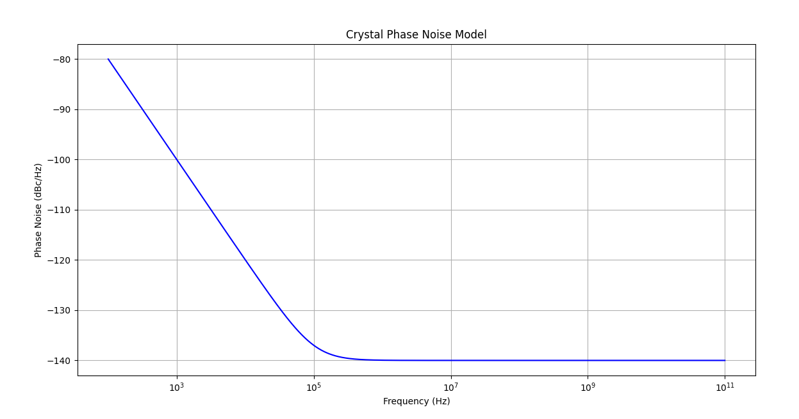
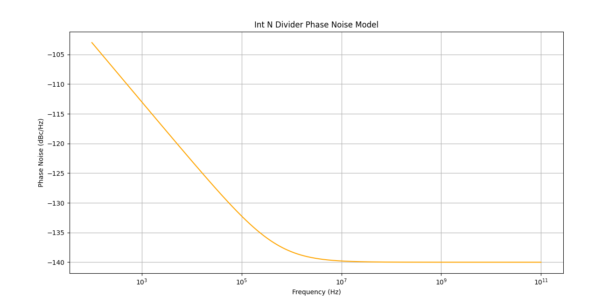
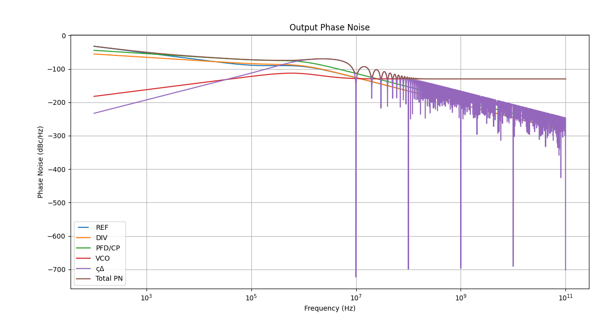

# System Model

Fractional-N PLL architecture uses a Fractional Clock Divider with DSM block as the frequency divider in a PLL system. In order to make the frequency of the VCO output signal equivalent to the frequency of a PFD reference signal, the frequency divider divides the frequency by a fractional value using the delta sigma modulation technique.

**Advantages:**
* $𝑓_{𝑟𝑒𝑓}$ in range of tens $MHZ →Loop BW ≈𝑓𝑒𝑤\  𝑀𝐻𝑧$
* Average between $M$ and $M + 1$
* Channel spacing and $𝑓_{𝑟𝑒𝑓}$ “decoupled” high $𝑓_{𝑟𝑒𝑓}$ and a wide loop bandwidth to suppress the VCO phase noise
* Less “amplification” of the reference phase noise.\

**Disadvantages:**
* Spurs
     Solved by : Randomization for modulus control

## Protocols
Compatible with WIFI / Bluetooth wireless communication protocols\
$13$ WiFi channels  $2412→2472\ (5MHz Spacing)$\
$79$ Bluetooth channels $2402→2480\ (1MHz Spacing)$\
We need a resolution of 1 MHz, can’t be acquired by Integer N PLL since it needs $𝑓_{𝑟𝑒𝑓}\ 𝐶ℎ𝑎𝑛𝑛𝑒𝑙\ 𝑠𝑝𝑎𝑐𝑖𝑛𝑔$

Modern Fractional N PLL :\
Dual modulus prescaler control\
But how it works ? \
For prescaler divide by $N$ for __A(VCO)__ output pulses and $N+1$ for **B**
$$\frac{(𝐴+𝐵)}{[\frac{𝐴}{𝑁}+\frac{B}{[𝑁+1}]}$$

## Desmos Visualization of the channel specturm

* [Channel spectrum visual modeling](https://www.desmos.com/calculator/dbc4pmegdf)

## System Design
### Crystal Oscillator
A Crystal Oscillator with 10MHz is used as a refrence input in our PLL design to cover the full range of Wifi/Bluetooth frequencies.
* $𝑓_{𝑟𝑒𝑓}=40 𝑀𝐻𝑧$ hard practical division ratio $75:25$
* $𝑓_{𝑟𝑒𝑓}=10 𝑀𝐻𝑧$ Easier practical division ratio $9:1$
* Phase noise $@\  1MHz$ offset	$<-140\  dBc/Hz$

#### Phase noise model

### PFD/CP

* $I𝐶𝑃=100𝜇𝐴$
* Compliance Range	$0.5V-1.5V$
* Phase noise $@\  1MHz$ offset	$<-223\  dBc/Hz$

#### Phase noise model

### Loop Filter

#### Phase noise model

### VCO

* Tuning range $[2.35G,2.55G]$.
* $𝐾𝑣𝑐𝑜\  ≈\  200MHz$
* Phase noise $@\  1MHz$ offset	$<-115\  dBc/Hz$

#### Phase noise model

Fractional N PLL with LC Osc (2.35GHz till 2.55GHz)\

### Divider 

Divider --> divide by $240.2 -248$ with step $0.1$ to get $1MHz$ resolution
For prescaler divide by $N$
	                                   

* $𝑓_{𝑅𝑒𝑓}=10\ 𝑀𝐻𝑧$
* Resoultion $1\ MHz$
* $DIV\  RATIO\  N=240-248$
* Step $0.1$
* Modulus control A B ratios	$𝐴=9\  ,\  𝐵=1$
$$\frac{(9+1)}{[\frac{9}{240}+\frac{1}{[240+1}]} \approx 240.09962 \approx 240.01$$ 

Phase Noise $@\  1\  MHz$ offset	$<-140$ dBc/Hz
#### Phase noise model

### Sigma Delta Modulator

* Need higher order sigma delta modulators for sharper noise shaping
* $3^{rd}$ Order sigma modulator

#### Phase noise model

## Total Phase Noise 

## System specifications 

| Spec | Value |
| --- | --- |
| `Center frequencies` | 2.402-2.480 GHz|
| `Phase noise @ 1MHz offset (From Standard)` |<-74 dBc/Hz |
| `Phase noise @ 2MHz offset (From Standard) ` |<-106 dBc/Hz|
| `Phase noise @ 3MHz offset (From Standard)` | <-116 dBc/Hz |
| `Synthesizer lock time (From Standard)  ` | (<68𝜇)|
| `Loop Bandwidth` | 150 KHz|
| `Phase margin ` | 55°|
| ` Expected Lock time   ` | 4/(𝐿𝑜𝑜𝑝 𝐵𝑊)≈26 𝜇𝑠|
| `Loop Filter Parameters` | Cz ≈268𝑝𝐹 ,Rz ≈12.5 𝐾Ohms , CP ≈29.5𝑝𝐹|

You can find the full specs for each block [here](../pll/system/design_specs/Specs.md).

### System modeling is done using three differnt ways: 
  - [Verilog-A model](../pll/system/verilog-A_model/README.md)
  - [Octave model](../pll/system/octave_model/System_Modeling.md)
  - [python model](../pll/system/python_model/README.md)

For PLL python modling, you could use google colab added [here](../pll/system/python_model/Jupyter_files/README.md) to have an interactive interface that you can use.
