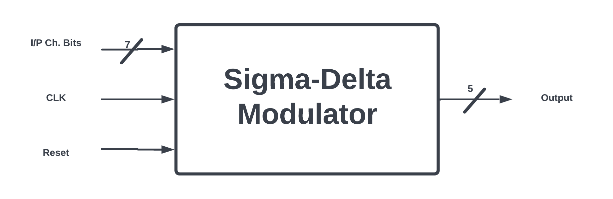
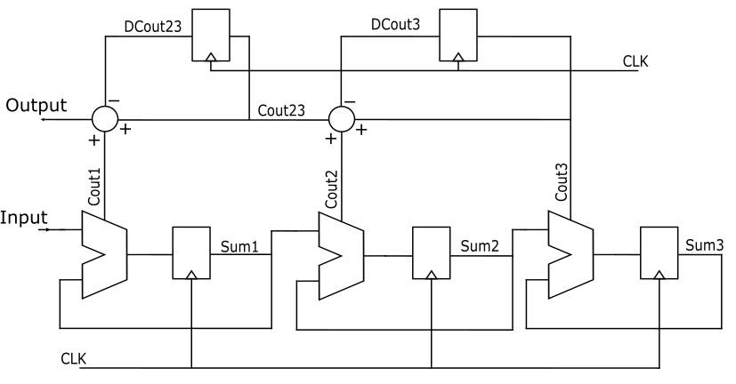
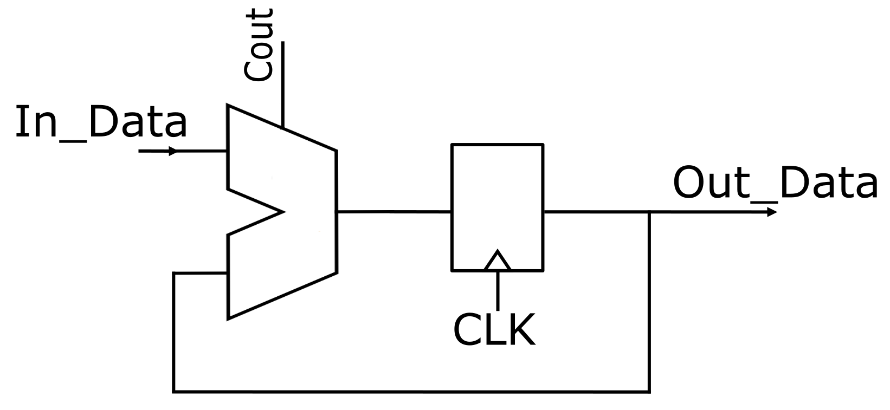
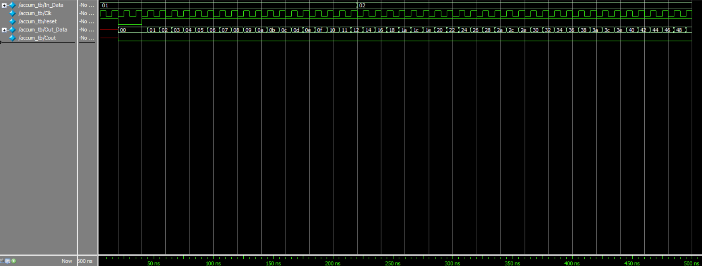
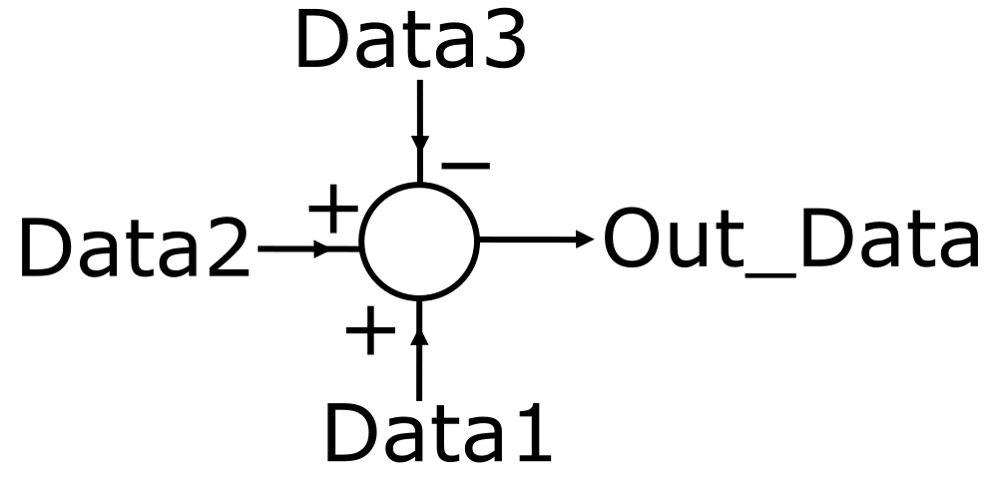
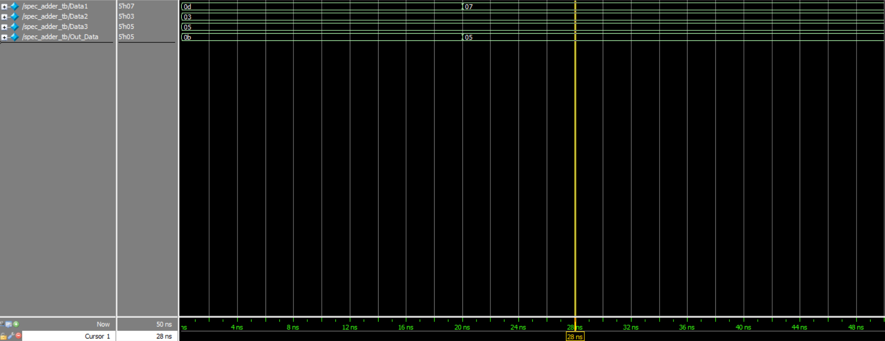
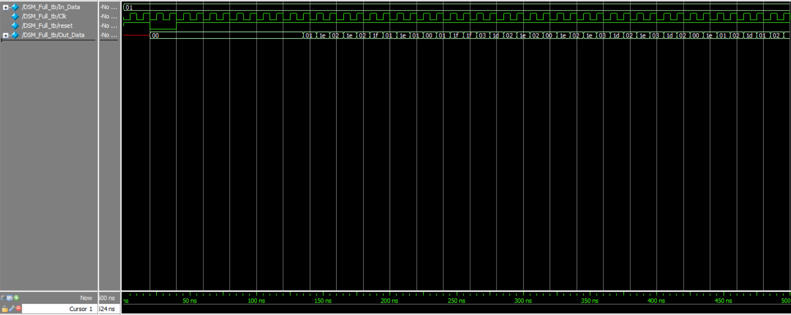

Sigma-Delta Modulator
=================

# Sigma-Delta Modulator Architecture

• The implemented Sigma-Delta Modulator is a MASH (Multi Stage Noise Shaping) architecture of 5th order as in MASH architectures the order of the modulator is determined by the number of the output bits.

• The implemented Sigma-Delta Modulator has the following inputs and outputs:

    - Inputs:   → Input channel bits (7 bits): Used to select a certain channel.
                → Clock (1 bit): Used for the registers in the design.
                → Reset (1 bit): Used to reset the registers in the design.
    -----------------------------------------------------------------------------
    - Output:   → Output passed to the divider (5 bits).

_____
  

# Digital Implementation

• The typical implementation of a MASH architecture is composed of a number of accumulators, adders, and regiesters arranged as illustrated:

____
  

# DSM Blocks
The designed Delta-Sgima Modulator (DSM) is implemented using Verilog HDL and is composed into 3 modules as follows:
## 1. Accumulator
• The accumulator in this design has 3 inputs (In_Data, CLK, Reset) and 2 outputs (Out_Data, Cout) as shown: 

• The results of the RTL code:

  

## 2. Special Adder
• This adder adds 2 numbers then subtracts a third number from them, it has 3 inputs and 1 output:

• The results of the RTL code:

  

## 3. Full DSM
• The fully integrated DSM has the following results for an input stream of (0000001) which selects the 2nd channel:

