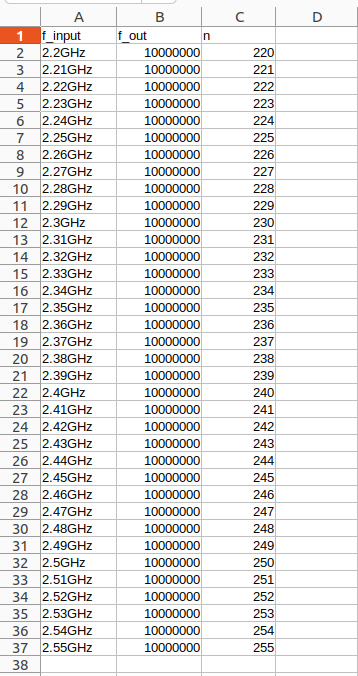

# Fractional-N divider automation

Folder contains a python script used to automate simulation runs for the divider from N=220 to N= 255 to cover all the frequency range while the input source in each trial is variable according to current division ratio.

For example: if N has a value 230 in the loop, hence the input source= 2.3GHz

in a result, the output frequency from the divider is expected to be 10 MHz through all the simulation runs. 

A capture from generated CSV file is depicted here:

