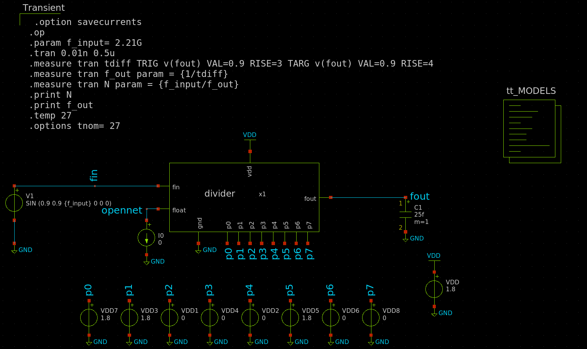
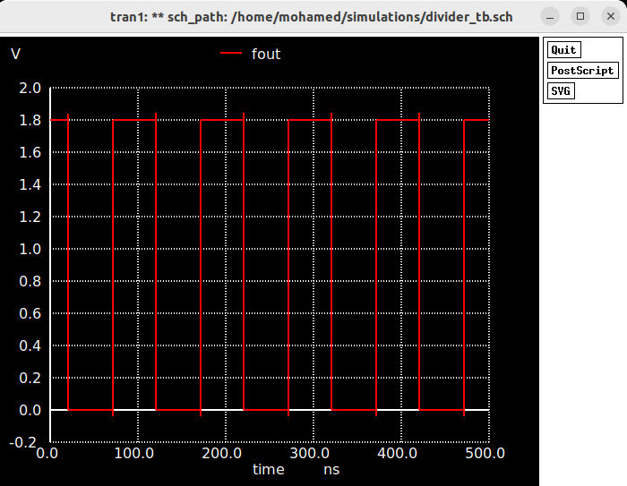
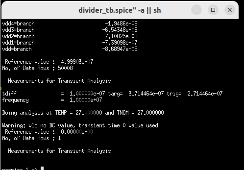

# Fractional-N divider simulation

Division ratio varies from 240 to 250 since the output frequency varies from 2.4 GHZ to 2.5 GHZ with reference crystal 10 MHZ.
Therefore, Transient simulation results are captured at N=245.

In order to divide by 245, Tout must equal 245*Tin. If we apply the next sequence: P7 P6 P5 P4 P3 P2 P1 P0
to be 00001011
We can get Tout= (256 - 0 * 128 - 0 * 64  - 0 * 32 - 0 * 16 - 1 * 8 - 0 * 4 - 1 * 2 - 1 * 1) Tin = 240 Tin.

The Testbench is depicted here:

The transient output is depicted in next figure.

The log file deteched to the simulation proves that F_out is accurate and equals 10 MHz.

