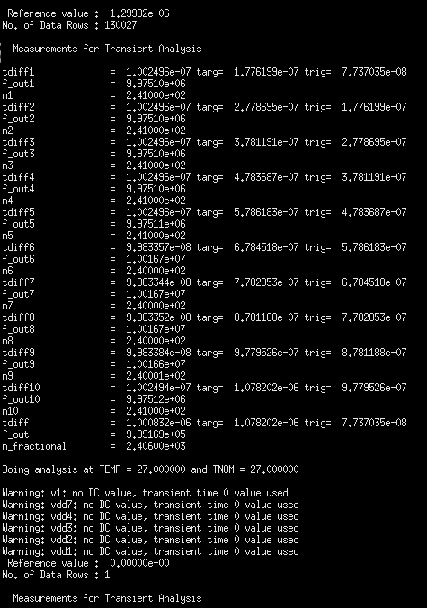
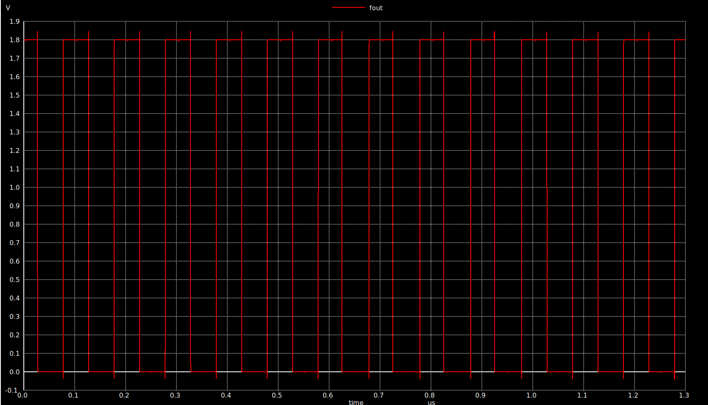

# Fractional-N divider Testing & simulation

The divider is tested to divide by fractional ratios rather than integer ratios as we have done in the nominal TB.  In order to implement fractional division ratios, the input control voltages or P's must by dynamic through the transient analysis, so the P's voltage sources are replaced by pulses coressponding to the selected division ratio.

The TB shows how the P's are selected to have N = 240.6 

240.6 division  ratio is generated from consecutive 240,241 divisions by specific ratio to get the factor or fractional in between.

The log file deteched to the simulation is depicted here:

The log files show the measured N for each cycle up to 10 cycles. Hence, N_fractional is the average N of all 10 cycles which is 240.6

The output transient signal is shown in next figure:

