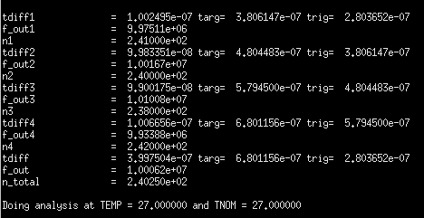
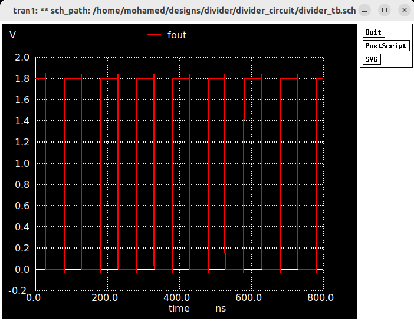

# Fractional-hopping Testing & simulation

The divider is tested to divide by different consecutive division ratios which means each cycle of the ouput signal is a representation  of a different division ratio.

The TB shows a pattern for division ratios (240, 241, 238, 242).

The log file deteched to the simulation is depicted here:

The log files show the measured N for each cycle from 4 consecutive cycles.
In addition, the resultant N for each consecutive 4 cycles is good intuation for proving how the divider is accurate in chossing the division ratio. N_total (the resultant N for each consecutive 4 cycles) is expected to be (240+241+238+242)/4 = 240.25

The output transient signal is shown in next figure:
