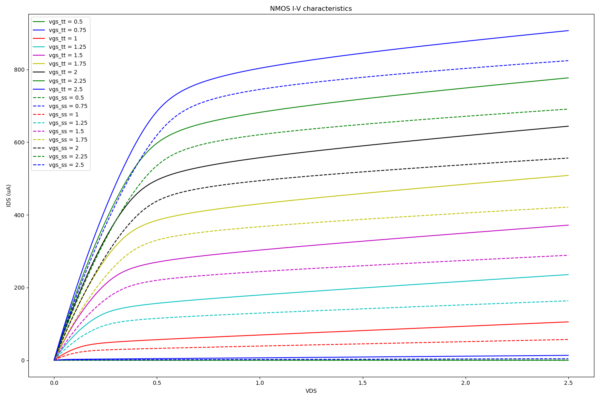
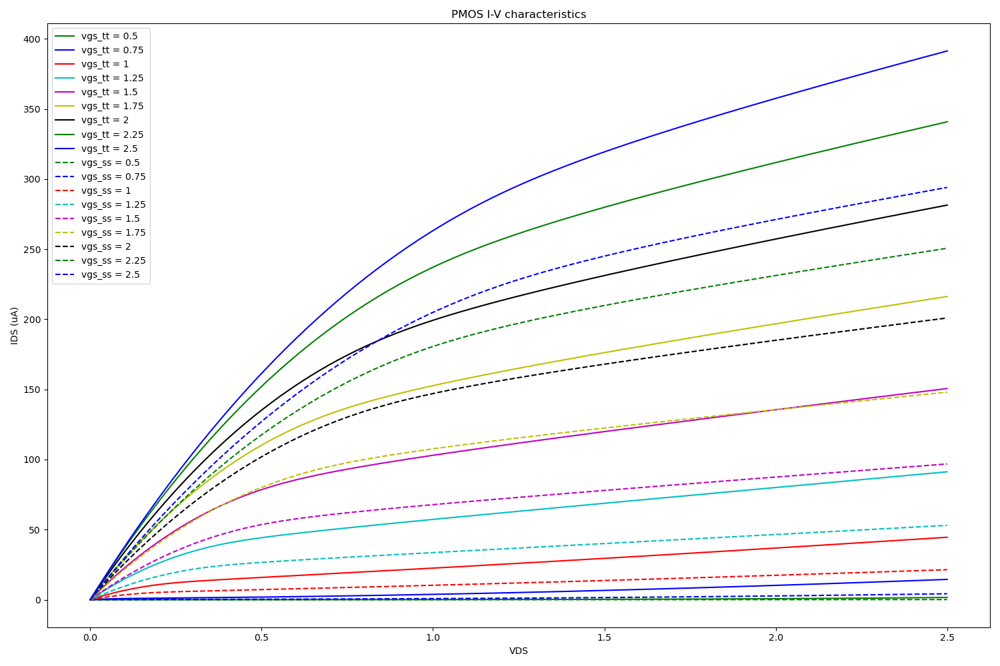

# Corner analysis (ss) on NMOS & PMOS transistor 

The lib introduces a good comparsion between the behavior of the transistors whether NMOS or PMOS in typical operation and slow corner operation.

from the above 2 figures, it is observed that the NMOS behavior in  slow operation doesn't have sharp change in I-V characteristic. On the other hand, PMOS has a very unique observable change in the charatcteristics,  which must probably lead to a failure in circuit operations.