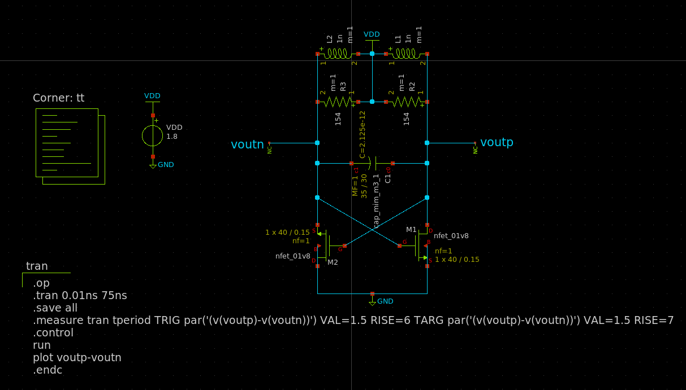
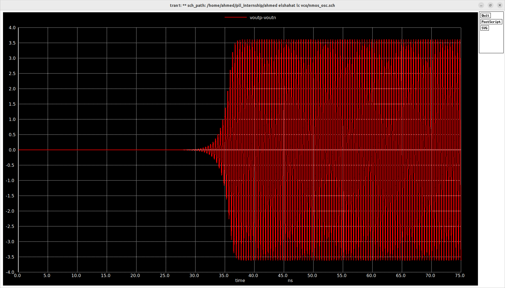
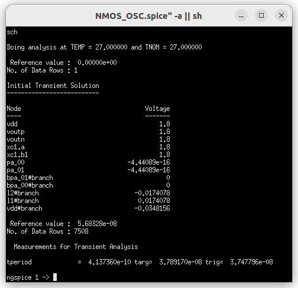

# **LC VCO Documentation**

 ### This file contain the documentation of the  NMOS oscillator without using a tail current source and any change in that design will be updated in this file with the detailed steps.

---
  

- ## Try1:
  - I wanted firstly to try the NMOS oscillator operating at 2.45 GHz and then compare its spec with PMOS and CMOS oscillators. 
  - NMOS oscillator as shown in the figure bellow uses a center tapped inductor, but i did not found any center tapped inductors in the provided devices. Therefore, i have used two inductors in series with VDD in between. But if that design is what we are going to use in the VCO, the center tapped will be easily implemented during the layout.
  - The losses of the inductor are modeled during RP.
  - I did not use the pi model of the inductor till now for simplicity but it will be used in the next steps.
  - I want to use the smallest available inductor to minimize the parasitic caps, but i don not know this value so i used 4 nH as a start.
  - Then i calculated the capacitance value to oscillate at 2.45 GHz which equals $5.2*10^-13 F$.  

  - Then i increased the widths of the transistors till the sustained oscillations show which happened at width of 20 um. The lengths of the transistor are chose to be the smallest available value (0.15 um) to increase the gm and decrease the parasitic capacitances. This produces oscillation of 3.6 volts and current of 1 mA .
  - I wanted to decrease that swing below 3.6 6 volts. Therefore, i tried to decrease the Rp which is achieved by decreasing the inductor value from 4nH to 1nH which decreased the RP from 616 ohms to 154 ohms. Then i tried to simulate the that new values but with the same widths but the sustained oscillation required an increase in the transistor width to be 40 um. These changes finally did not change the swing and it remained around the 3.6 volts and current is increased as shown. This because changing the sized of the transistors has changed both currents and gm as we have no control on the current or gm separately.
  
    
  
  

  ---
  
 