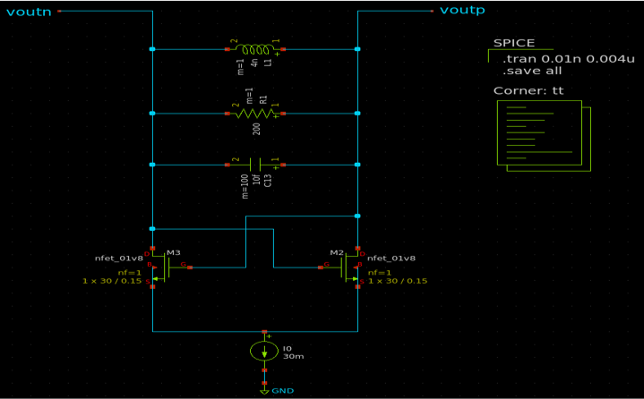
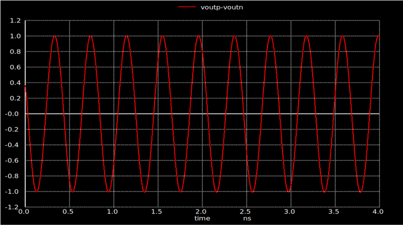

Initial Design
=================

    - A simple inductor model is used which is composed of an ideal inductor in parallel with a resistor which represents the losses of the inductor.
    - Varactor isn't implemented yet, so a capacitor is used.
    - The values of the inductor and the capacitor are adjusted to get a resonance frequency at 2.45 GHz.
    - The size of the NMOS cross coupled pair is adjusted to generate a negative resistance which negates the positive resistance of the inductor.

_________________________________________________________________________
- Implemented NMOS based LC VCO operating at 2.45 GHz
    - Schematic:
    
    
    
    - Output: 
    
    

