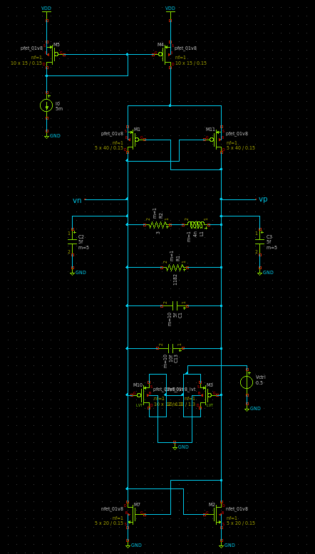
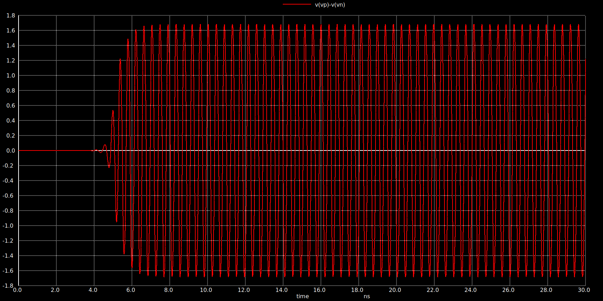
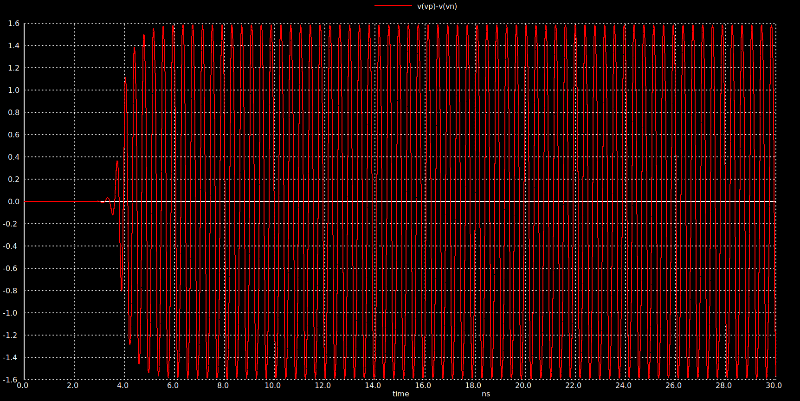
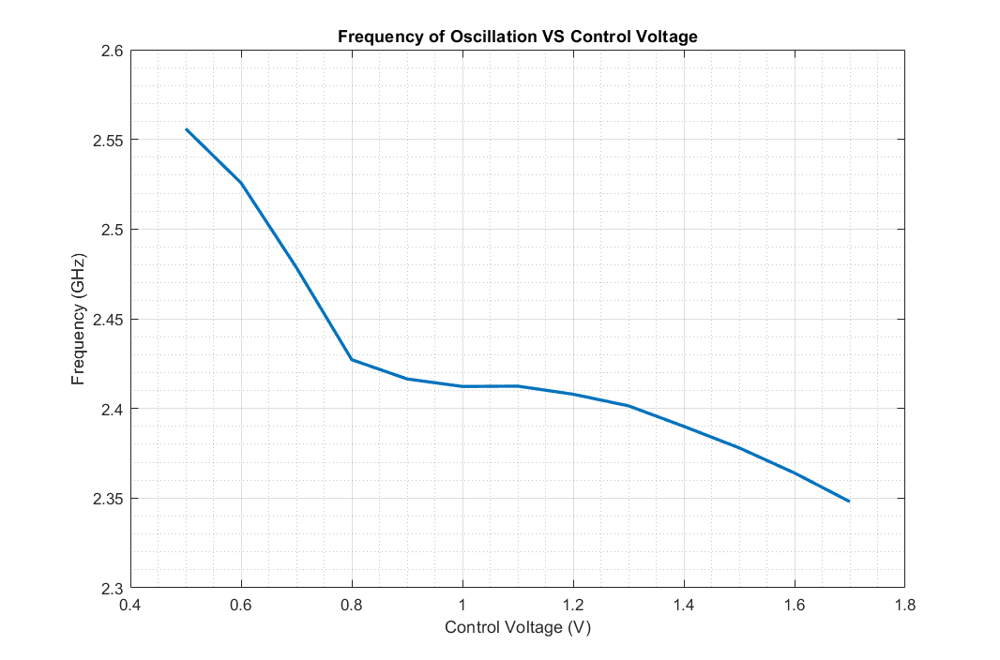

CMOS LC VCO Design
=================

- Implemented CMOS based LC VCO operating from 2.35 to 2.55 GHz with voltage tuning range from 0.5 to 1.7 V

    - Schematic:
   
    
	
    - Output(frequency = 2.35 GHz):
   
    
	
	- Output(frequency = 2.55 GHz):

    
	
	- Frequncy of oscillation VS Control Voltage:

    
