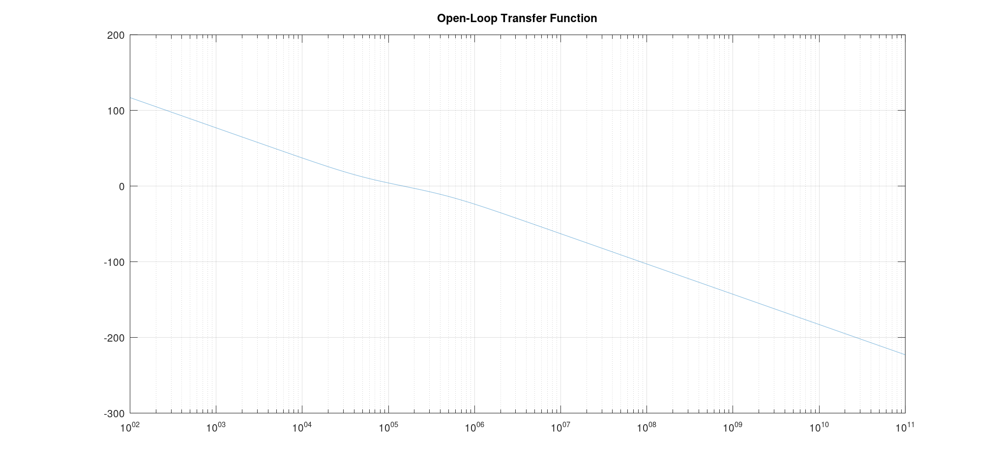
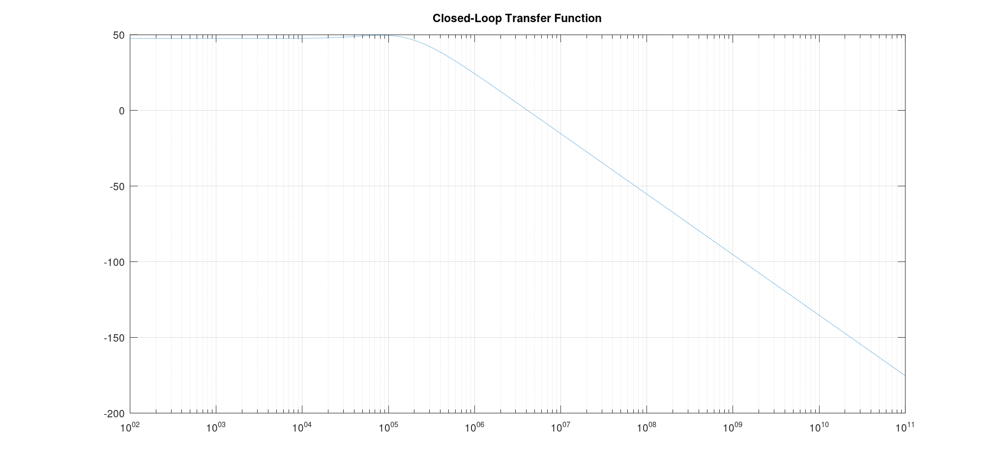
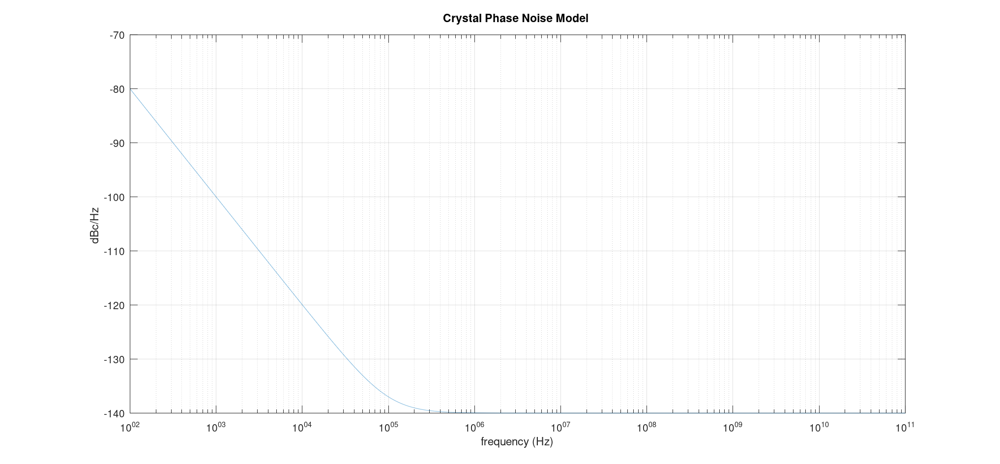
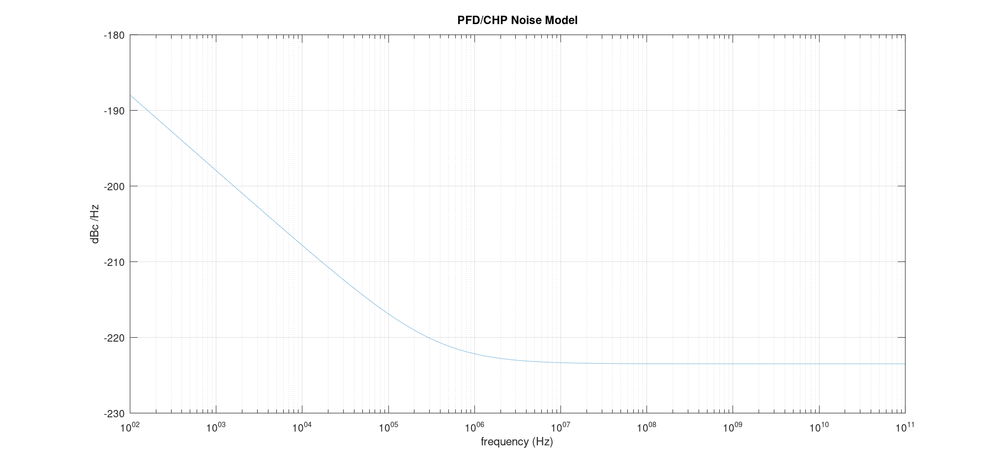
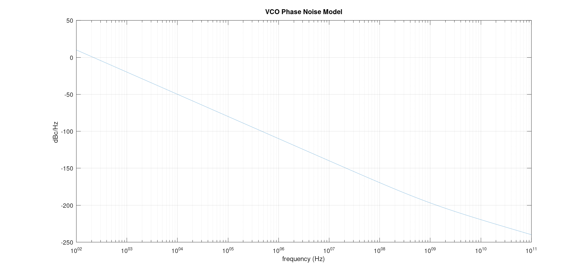
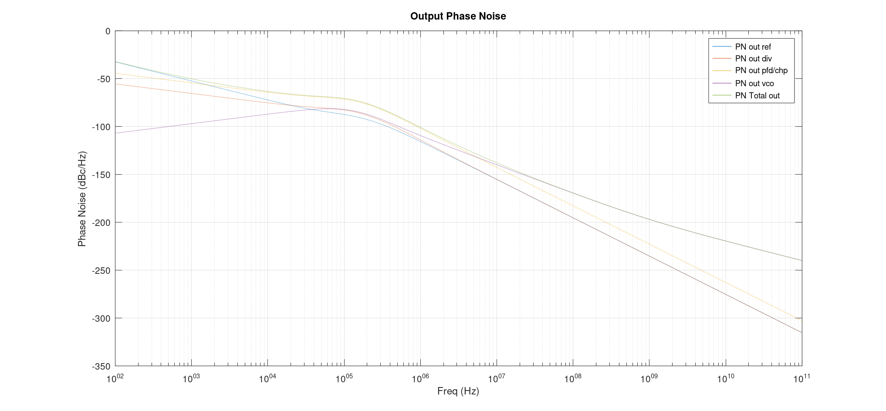

# PLL System Design

## System Parameters:
* Kvco = 200MHz/V
* Ichp = 100uA
* Fref = 10 MHz
* Fout = 2.402 GHz
* Loop Bandwidth = 150 KHz
* Phase margin = 55

## Open loop response:

## Closed loop response:

## Phase noise profile of each block:

### Crystal Oscillator Noise Model

### PFD/CHP Noise Model

### VCO Noise Model

### Divider Noise Model

As in the following figure, each noise source sees a different transfer function depending on the position in the loop to the output.

## Total Output Phase noise

| Phase Noise | Value |
| --- | --- |
| `@ 1MHz offset` |-99.8 dBc/Hz |
| `@ 2MHz offset` |-111.4 dBc/Hz|
| `@ 3MHz offset` |-119.5dBc/Hz |
