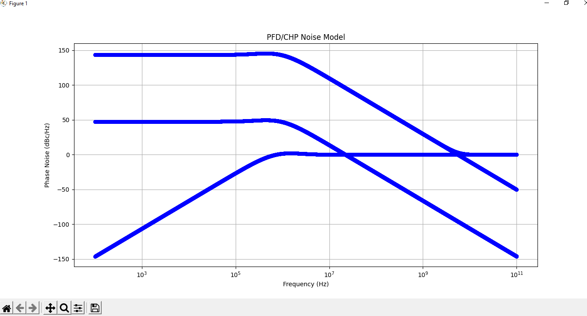

18 August 2022
---
# _Status of the python Models_
 
---

* Need to model the loop filter parameters calculator

* Python models are compiled and are working probably but there is a catch in the figures that I seem to have missed

* Some figures are outputted correctly and some are not.
  
Here are the samples

As clearly shwon in the images some figures are not correct for some reasons.
